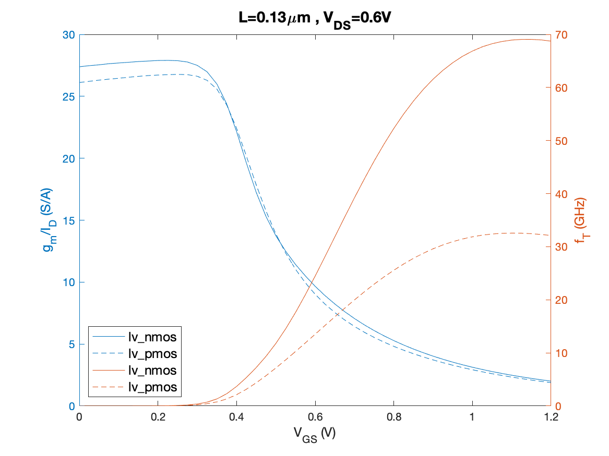
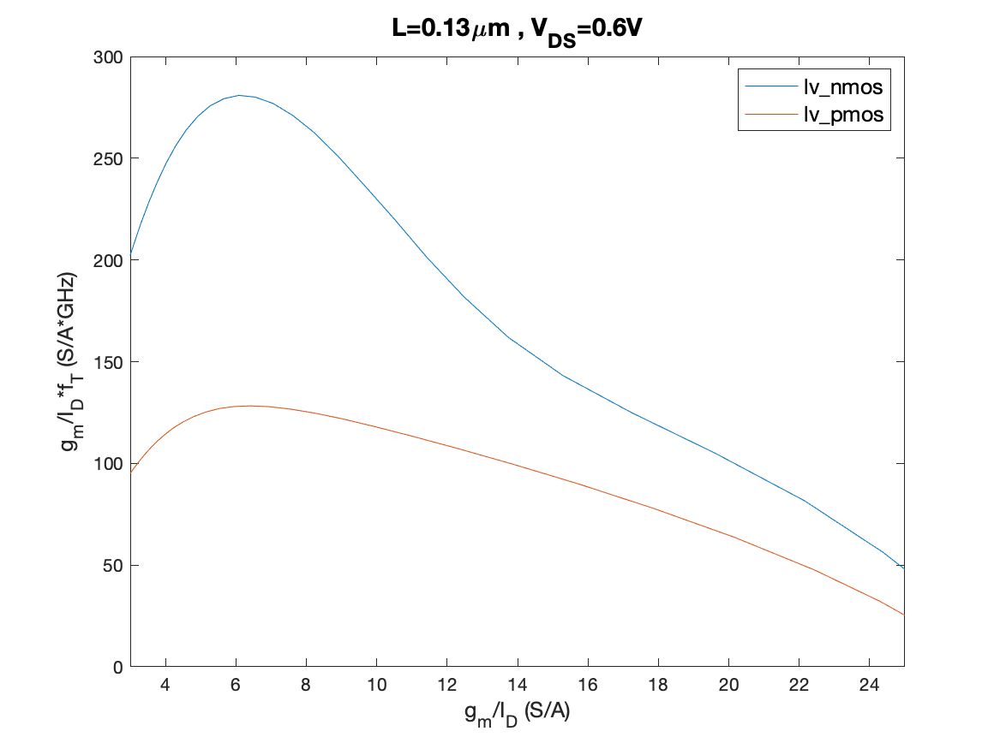
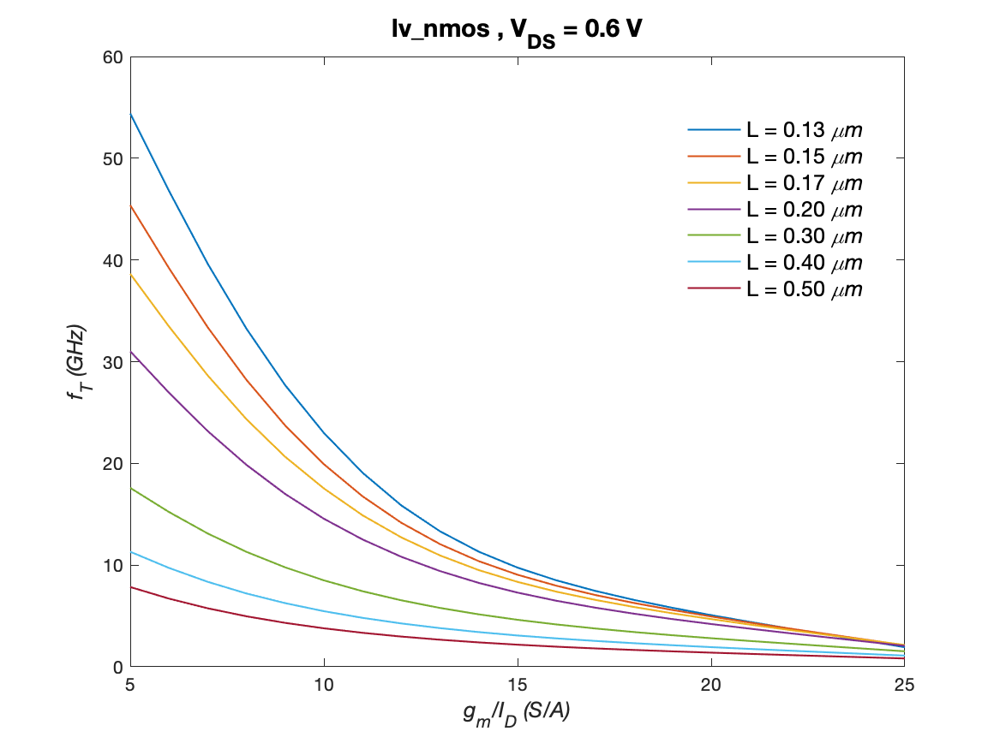
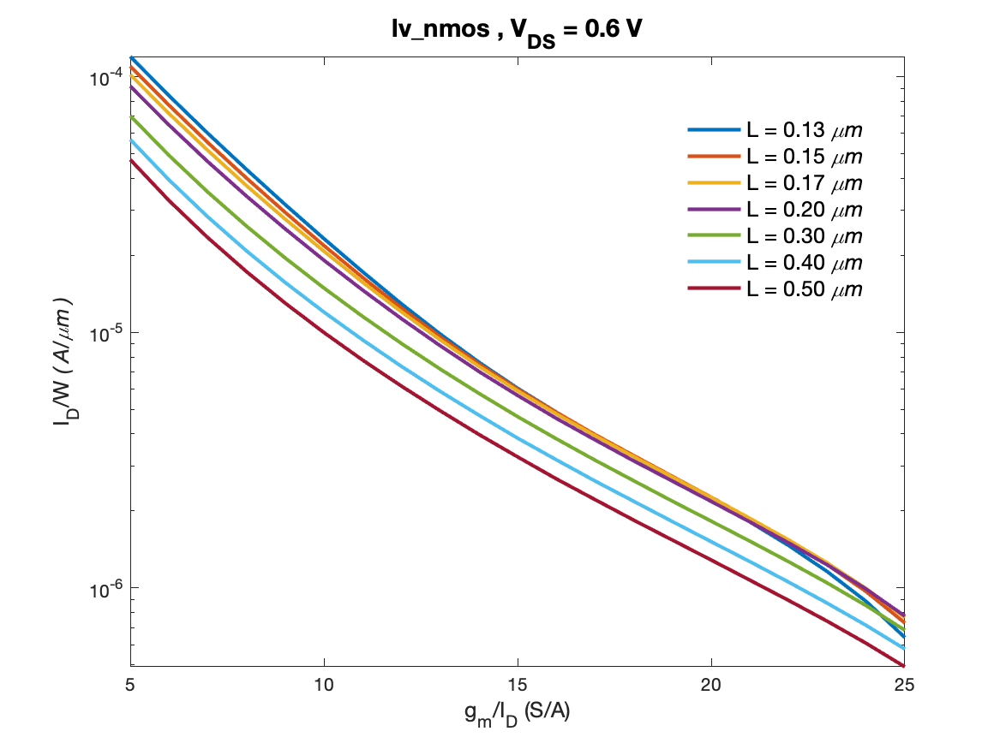
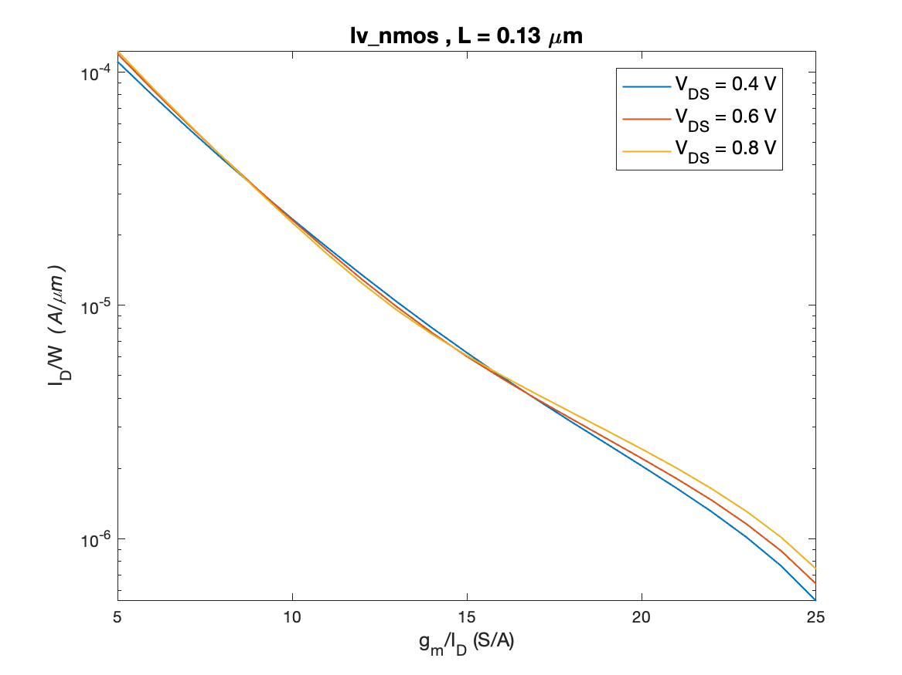
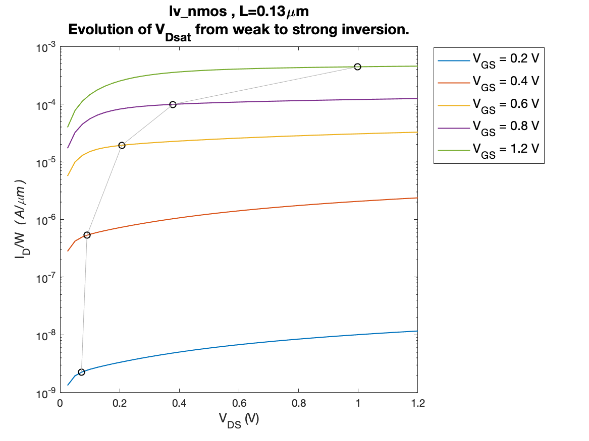
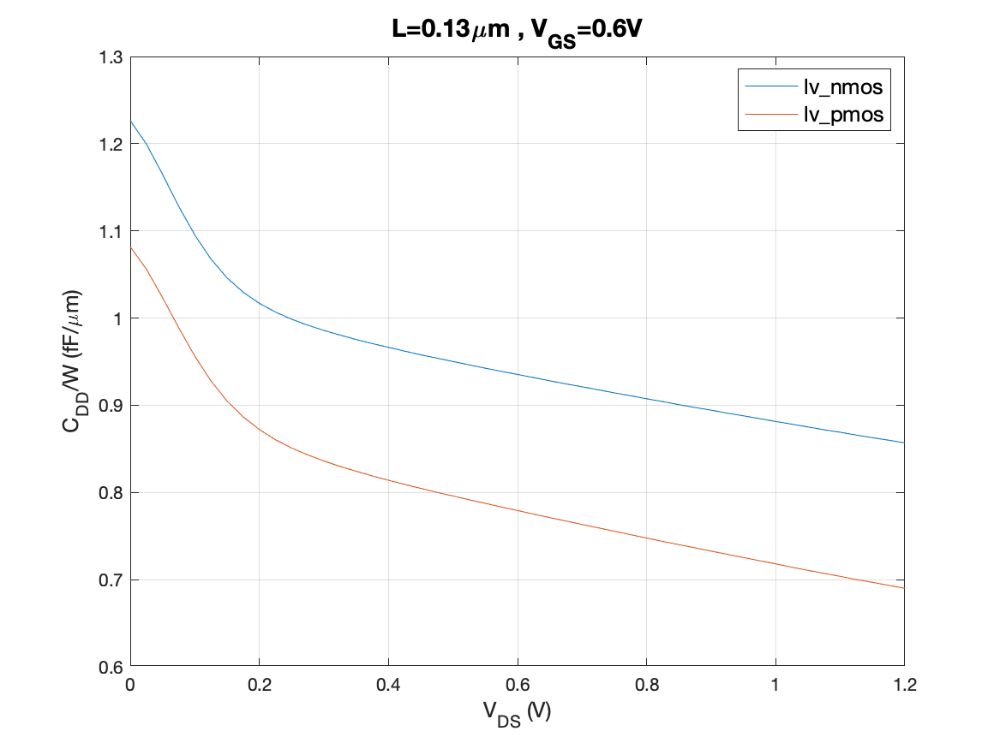
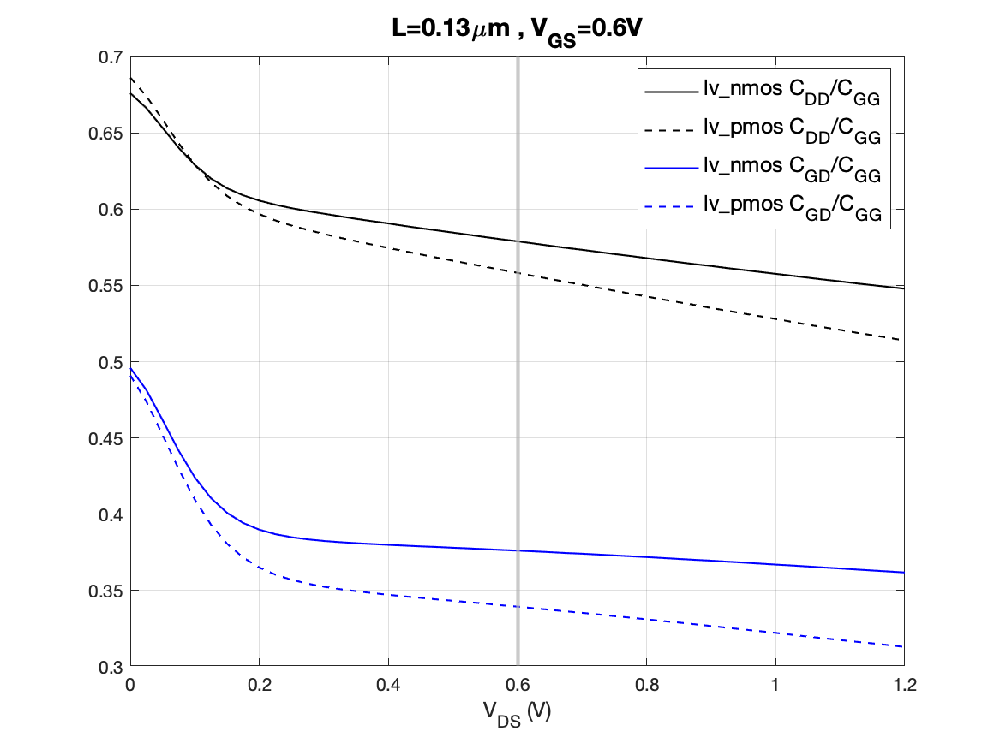

Source: [B. Murmann's github](https://github.com/bmurmann/EE628/tree/main/4_Technology)

   

In the above plot, $f_T=(1/2\pi) \cdot g_m/C_{GG}$, where $C_{GG} = cgg+cgsol+cgdol$. The lower case variables are the capacitances reported by NGspice.

   

The plot above shows the product $g_m/I_D \cdot f_T$. The peak can be viewed as a biasing sweet spot. The unusual "hump" for the NMOS curve hints at modeling issues in moderate inversion ($g_m/I_D>10 S/A$). These curves usually look like upside-down parabolas without drastic slope changes.

   

   

The above NMOS plot has an odd-looking curvature at the transition between strong to moderate inversion.

   

   

The above plot shows that the dependency of the current density $I_D/W$ on $V_{DS}$ is weak. Typically it is ok to work with data generated at $V_{DD}/2$.

   

---

   

In the above plot, $C_{DD} = cdd+cgdol+cjd$. The lower case variables are the capacitances reported by NGspice.

   

In the above plot, $C_{DD} = cdd+cgdol+cjd$,  $C_{GG} = cgg + cgdol + cgsol$ and $C_{GD} = cgd = cgdol$.
The lower-case variables are the capacitances reported by NGspice.

**NOTE:** for $V_{DS} > 0.2V$ the ratios of the capacitances don't vary much.

At $V_{DS}=0.6V$:  
$(C_{DD}/C_{GG})n = 0.5789$ and $(C_{DD}/C_{GG})p = 0.5582$ 
$(C_{GD}/C_{GG})n = 0.3762$ and $(C_{GD}/C_{GG})p = 0.3394$

