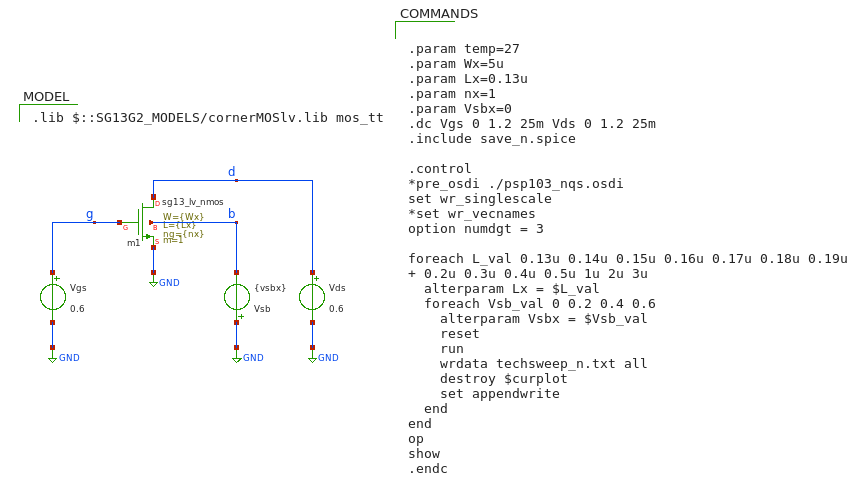
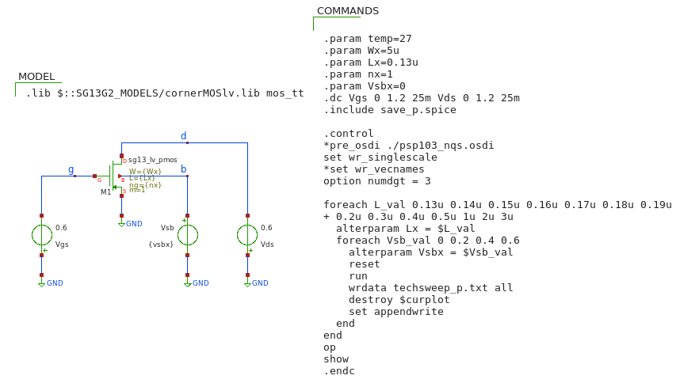

g_${m}$/I${_D}$ LUTs

### Xschem's setup to generate the LUTs

#### techsweep_n.sch

   

#### techsweep_p.sch

   

### Steps to generate and use the LUTs (.mat files)
- Run the NGspice simulations (techsweep_n.spice and techsweep_p.spice)
- Read the NGspice output data (txt) into Matlab scripts and save each parameter set (NMOS, PMOS) in mat file format
  (i.e. run save_n.m 
- Use the look_up and the look_upVGS functions to read the mat file data
