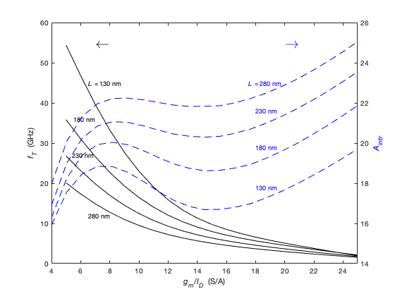
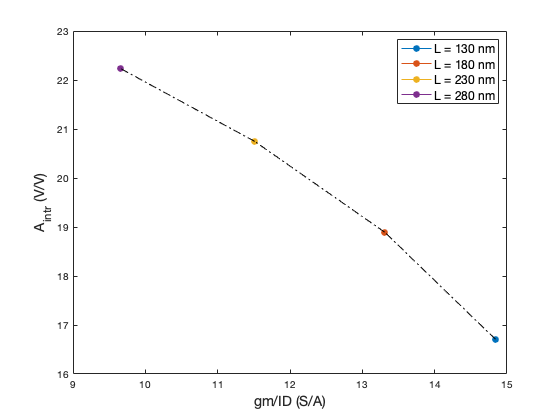
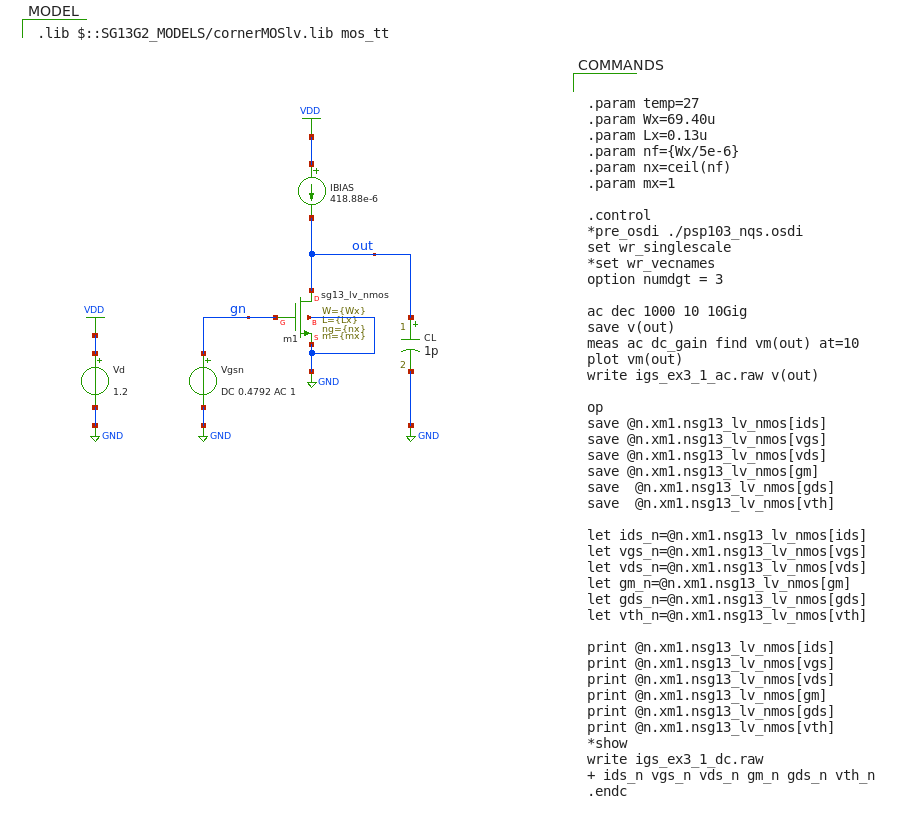

## Intrinsic gain stage (IGS): sizing for given L and $g_{m}/I_{D}$  
Size the IGS so that $f_{u}$=1 GHz when $C_{L}$=1 pF. <br> 
Assume L=130 m and $g_{m}/I_{D}$=15 S/A, $V_{DS}$=0.6 V and $V_{SB}$=0 V.

#### matlab's design script (igs_ex3_1.m)
```
% File: igs_ex3_1.m
% source: Jesper and Murmann textbook
% example 3_1 pp.66-70
% basic IGS - sizing for given gm/ID=15 and L=130nm

clear all; clearvars; close all; clc;

addpath('~/ihome/class/gmidLUTs;~/ihome/class/gmidTECHs')
load ('sg13_lv_nmos.mat');

% spec
fu = 1e9;
CL = 1e-12;
gm_id = 15;
L = min(nch.L) % units are in um
VSB = 0;
VDD = 1.2;
VDS = VDD/2;

% computations
gm = 2*pi*fu*CL;
ID = gm/gm_id;

JD = look_up(nch,'ID_W','GM_ID',gm_id,'L',L,'VDS',VDS,'VSB',VSB)
W = ID/JD;
VGS = look_upVGS(nch,'GM_ID',gm_id,'L',L,'VDS',VDS,'VSB',VSB);

avo = look_up(nch, 'GM_GDS','GM_ID',gm_id,'L',L,'VDS',VDS,'VSB',VSB);
fT = look_up(nch,'GM_CGG','GM_ID',gm_id,'L',L,'VDS',VDS,'VSB',VSB)/2/pi;
gds = gm/avo;
FO = fT/fu; 

fprintf("\n------ Specs ------\n")
fprintf('VDS = %.2f\n',VDS)
fprintf('VSB = %.2f\n',VSB)
fprintf('CL = %.2f (pF)\n',CL*1e12)
fprintf('fu = %.2e (Hz)\n',fu)
fprintf('L = %.2f (um)\n',L);
fprintf('gm/id = %.2e (S/A)\n',gm_id);

fprintf("\n------ Results ------\n")
fprintf('VGS = %.4f (mV)\n',VGS);
fprintf('ID = %.4f (uA)\n',ID*1e6);
fprintf('W = %.2f (um)\n',W);
fprintf('gm = %.2e (S)\n',gm);
fprintf('gds = %.2e (V/V)\n',gm/avo);
fprintf('avo = gm/gds = %.2f (V/V)\n',avo);
fprintf('gds = %.4e (V/V)\n',gds);
fprintf('VA = %.4f (V)\n',ID/gds);
fprintf('fT = %.4e (Hz)\n',fT)
fprintf('FO = fT/fu = %.2f\n',FO)

fprintf("\n------ Sweeping L ------\n")
% data ===========================
gmID = (5:25);          % (S/A)
L    = .13: .05: .28    % (µm) - [0.13 0.18 0.23 0.28]

% compute ========================
Aintr = look_up(nch,'GM_GDS','GM_ID',gmID,'L',L);        % matrix 4 x 24
fT    = look_up(nch,'GM_CGG','GM_ID',gmID,'L',L)/(2*pi); % matrix 4 x 24

for k = 1:length(L),
    gmID1(k) = interp1(fT(k,:),gmID,1e10); 
    Avo1(k)  = diag(interp1(gmID,Aintr(k,:),gmID1(k)));
    % CT: sanity check: do we really need to take the diagonal?
    %     The answer is NO!
    %     Avo1 and Avo2 are both of size 1 x 4 and are the identical 
    Avo2(k)  = interp1(gmID,Aintr(k,:),gmID1(k));
end
% values of gm/ID for which fT = 10*fu at L= [0.13 0.18 0.23 0.28] um
gmID1
% intrinsic gain at the computed values of gm/ID for L= [0.13 0.18 0.23 0.28] um   
Avo1
Avo2

% plot the (gm/ID, Avo) pairs for L = [0.13, 0.18, 0.23 0.28] um
figure(1)
% loop to get the dots of different colors
for k = 1:length(L)
    h = plot(gmID1(k),Avo1(k),'o-');
    set(h, 'markerfacecolor', get(h, 'color'));
    hold on;
end
% join the dots
line([gmID1(1),gmID1(2)],[Avo1(1),Avo1(2)],'color','black',...
    'linestyle','-.')
line([gmID1(2),gmID1(3)],[Avo1(2),Avo1(3)],'color','black',...
    'linestyle','-.')
line([gmID1(3),gmID1(4)],[Avo1(3),Avo1(4)],'color','black',...
    'linestyle','-.')
xlabel('gm/ID (S/A)','FontSize',14)
ylabel('A_{intr} (V/V)','FontSize',14)
legend('L = 130 nm','L = 180 nm','L = 230 nm','L = 280 nm','Fontsize',12)
% legend('boxoff')
hold off;

% plot ===========================
h1 = figure(2);
[AX,H1,H2] = plotyy(gmID,1e-9*fT,gmID,Aintr,'plot');
grid off;

set(get(AX(1),'Ylabel'),'string','{\itf_T}  (GHz)')
set(get(AX(2),'Ylabel'),'string','{\itA_i_n_t_r}','color',"blue")
xlabel('{\itg_m}/{\itI_D}  (S/A)');
xlim([4 25])
set(H1,'linestyle','-', 'linewidth', 1)
set(H2,'linestyle','--', 'linewidth', 1)
set(H1,'color', 'k')
set(H2,'color', 'b')

text(6.5,12,'280 nm','FontSize', 9)
text(5.4,27,'230 nm','FontSize', 9)
text(5.5,36,'180 nm','FontSize', 9)
text(6.5,45,'{\itL} = 130 nm','FontSize', 9)

text(17.5,45,'{\itL} = 280 nm','FontSize', 9,'Color',"blue")
text(18,38,'230 nm','FontSize', 9,'Color',"blue")
text(18,29,'180 nm','FontSize', 9,'Color',"blue")
text(18,19,'130 nm','FontSize', 9,'Color',"blue")

text(7,55,'\leftarrow','fontsize', 20)
text(20,55,'\rightarrow','fontsize', 20,'Color',"blue")
```

------ Specs ------<br>
VDS = 0.60 (V)<br>
VSB = 0.00 (V)<br>
CL = 1.00 (pF)<br>
fu = 1.00e+09 (Hz)<br>
L = 0.13 (um)<br>
gm/id = 1.50e+01 (S/A)<br>

------ Results ------<br>
VGS = 0.4792 (V)<br>
ID = 418.8790 (uA)<br>
W = 69.40 (um)<br>
gm = 6.28e-03 (S)<br>
gds = 3.77e-04 (S)<br>
avo = gm/gds = 16.68 (V/V)<br>
gds = 3.7664e-04 (S)<br>
VA = 1.1121 (V)<br>
fT = 9.7496e+09 (Hz)<br>
FO = fT/fu = 9.75<br>

<p align="center">
   
</p>
<p align="center">
Fig. Transit frequency $f_{T}$ and intrinsic gain $A_{intr}$ versus $g_{m}/I_{D}$ for various L
</p>
<p align="center">
   
</p>
<p align="center">
Fig. ($g_{m}/I_{D}$, $A_{intr}$) pairs for various L
</p>

#### Xschem/NGspice simulation setup to verify the design (igs_ex3_1.sch)
<p align="center">
   
</p>

#### IMPORTANT NOTE:
The valid range of the models provided for the transistors sg13_lv_nmos and sg13_lv_pmos are:<br>
L = (0.13 - 10) μm<br>
W = (0.15 - 10) μm<br>
If the transistor's width required is above 10μm make sure to use multiple fingers.

#### matlab's script to post-process the simulation results (igs_ex3_1_sim.m)
```
% File: igs_ex3_1_sim.m
% post processing ngspice simulation results
% for basic IGS (sizing for given gm/ID=15 and L=130nm)


clear all; clearvars; close all; clc;

addpath('~/ihome/HspiceToolbox');
% AC analysis
x = loadsig('./simulations/igs_ex3_1_ac.raw')
% lssig(x)

freq = evalsig(x, 'FREQUENCY');
vout = evalsig(x, 'out');
mag = abs(vout);
magdb = 20*log10(mag);

gaindb = max(magdb);
gain = max(mag);
% bandwidth
idx1 = find(magdb <= gaindb-3, 1, 'first');
f3db = freq(idx1);
% fu
idx2 = find(magdb <= 0, 1, 'first');
fu = freq(idx2);

figure(1);
semilogx(freq,magdb,'LineWidth',2);
grid on;
xlabel('frequency (Hz)','fontsize',14);
ylabel('magnitude (dB)', 'FontSize',14);
xlim([1e1,1e10])
ylim([-5 30])
hold on;
% annotate fu
yline(0); % unit gain (0 dB)
plot(fu,0,'o','MarkerSize',12,'Linewidth',2);
str = ['fu \approx ',num2str(fu*1e-9,'%.4f'), ' GHz'];
text(1e7,1,str,'fontsize',12)
% annotate avo
str = ['a_{vo} \approx ',num2str(gaindb,'%.4f'), ' dB (= ',...
    num2str(gain,'%.2f'), ' V/V)'];
text(2e1,26,str,'fontsize',12)
% annotate f3db
str = ['f_{3dB} \approx ',num2str(f3db*1e-6,'%.2f'), ' MHz \rightarrow'];
text(2e5,gaindb-3, str, 'fontsize',12)

% DC analysis
x = loadsig('./simulations/igs_ex3_1_dc.raw')
% lssig(x)

ids = evalsig(x,'ids_n');
vgs = evalsig(x,'vgs_n');
vds = evalsig(x,'vds_n');
vth = evalsig(x,'vth_n');
gm = evalsig(x,'gm_n');
gds = evalsig(x,'gds_n');
gm_id = gm/ids;
avo = gm/gds;
vdsat = 2/gm_id; % approx

fprintf('ID = %.4e (A)\n',ids)
fprintf('VGS = %.4f (V)\n',vgs)
fprintf('VTH = %.4f (V)\n',vth)
fprintf('VDS = %.4f (V)\n',vds)
fprintf('VDSAT = %.4f (V)\n',vdsat)
fprintf('gm = %.4e (S)\n',gm)
fprintf('gm/ID = %.2f (S/A)\n',gm_id);
fprintf('gds = %.4e (S)\n',gds);
fprintf('avo=gm/gds = %.2f (V/V)\n',avo);

```

ID = 4.1888e-04 (A)<br>
VGS = 0.4792 (V)<br>
VTH = 0.4346 (V)<br>
VDS = 0.6028 (V)<br>
VDSAT = 0.1333 (V)<br>
gm = 6.2831e-03 (S)<br>
gm/ID = 15.00 (S/A)<br>
gds = 3.7570e-04 (S)<br>
avo=gm/gds = 16.72 (V/V)<br>

<p align="center">
   
</p>

#### Comparing the design and the simulation

\% Error = $\dfrac{T-E}{T}$ $\times 100$
<br><br>
% Error on $V_{DS}$ : 0.5%<br>
% Error on $g_{m}$ : 0.05%<br>
% Error on $g_{ds}$ : -0.35<br>
% Error on $A_{Vo}$ : 0.24%<br>
% Error on $f_{u}$ :  <br>

*The design using the LUTs is right on target!*
<p align="center">
   
</p
