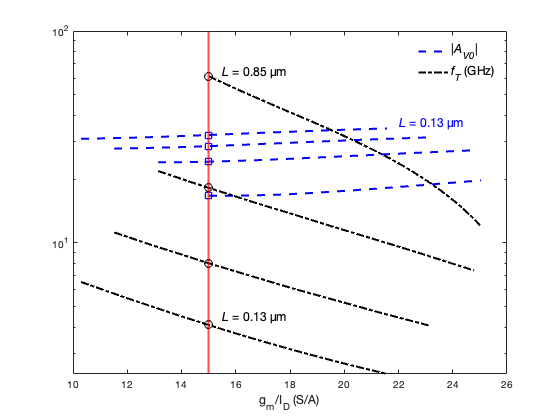
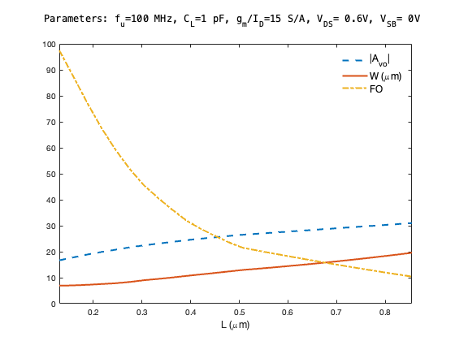
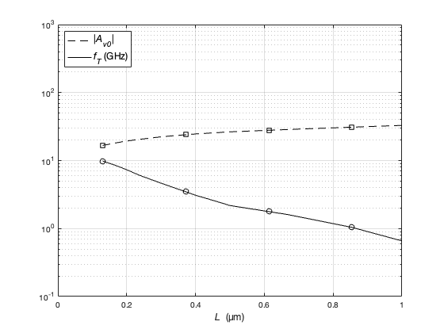
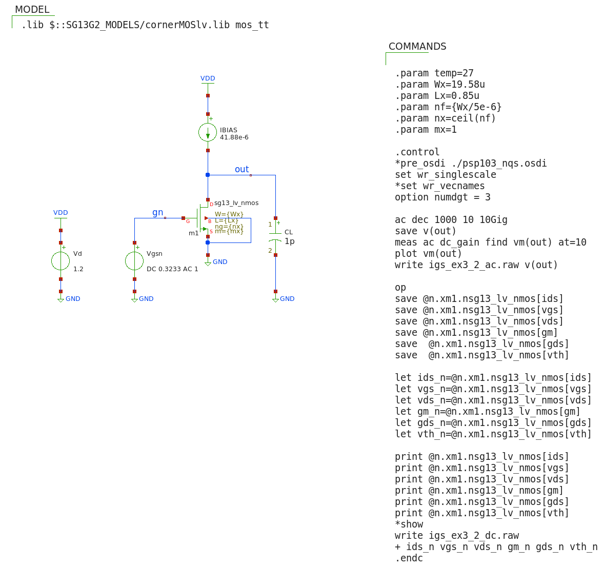
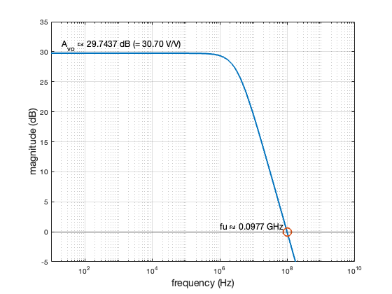

## IGS: sizing at constant $g_{m}/I_{D}$  

Consider an IGS with $C_{L}$ = 1 pF and $g_{m}/I_{D}$=15 S/A. <br>
Find combinations of L, W and $I_{D}$ that achieve $f_{u}$=0.1 GHz and compute the corresponding DC gain ($A_{vo}$) <br> 
and fan-out (FO = $f_{T}/f_{u}$).

Sizing for constant $g_{m}/I_{D}$ is typical of circuits that are either limited by distortion (linearity places an <br> 
upper bound on $g_{m}/I_{D}$) or that operate at low voltage and require a large signal swing ( $g_{m}/I_{D}$ = 2 / $V_{Dsat}$ ). <br>

#### matlab's design script (igs_ex3_2.m)

```
% File: igs_ex3_2.m
% source: Jesper and Murmann textbook
% example 3_2 pp. 71-73
% basic IGS - sizing for constant gm/ID=15 to achieve fu = 1GHz

clear all; clearvars; close all; clc;

addpath('~/ihome/class/gmidLUTs;~/ihome/class/gmidTECHs')
load ('sg13_lv_nmos.mat');

% specs
% -----
fu = 0.1e9;
CL = 1e-12;
gm_id = 15;
VSB = 0;
VDD = 1.2;
VDS = VDD/2;

% computations
% ------------
% Since gm/ID is constant and gm (i.e., fu and CL) is fixed by spec. the
% drain current ID is also constant, regardless of the chosen L
gm = 2*pi*fu*CL;
ID = gm/gm_id;

NL = length(nch.L);
Lvec = linspace(nch.L(1),nch.L(NL)); % slice L in 100 points

JD = look_up(nch,'ID_W', 'GM_ID', gm_id, 'L',Lvec);
% JD = logspace(-9,-4.2,50); % alternative: Jesper and Murmann style
W = ID./JD;
gm_ID = look_up(nch,'GM_ID','ID_W',JD,'L',Lvec)';
fT = look_up(nch,'GM_CGG','GM_ID',gm_id,'L',Lvec)/(2*pi);
FO = fT/fu;
Avo = look_up(nch,'GM_GDS','GM_ID',gm_id,'L',Lvec);


% acceptable FO >= 10
M = FO >= 10;          % index vector of usable L range
Lmax = max(Lvec(M))    % the largest achievable gain is for Lmax
Lmin = min(Lvec(M))    
N = find(M,1,'last');     % index of Lmax
% P = max(find(M==1));    % number of usable L <-> same as N :-)

Avo_m = look_up(nch,'GM_GDS','GM_ID', gm_id,'L',Lvec(M));
L_m   = Lvec(M);
fT_m  = fT(M);
W_m = ID./look_up(nch,'ID_W','GM_ID', gm_id,'L',L_m);

L = linspace(min(Lvec(M)), max(Lvec(M)),4); % take 4 of the usable L

GM_ID = look_up(nch,'GM_ID','ID_W',JD,'L',L)';
AV0 = look_up(nch,'GM_GDS','GM_ID',GM_ID,'L',L)';
FT = 1e-9*look_up(nch,'GM_CGG','GM_ID',GM_ID,'L',L)';

% mark L
for k = 1: length(L)
    fT1(k,1)  = interp1(GM_ID(:,k),FT(:,k), 15,'spline');  % gm_id = 15
    Av01(k,1) = interp1(GM_ID(:,k),AV0(:,k), 15,'spline'); % gm_id = 15
    %fT1(k,1)  = interp1(GM_ID(:,k),FT(:,k), 15.01);      % gm_id = 15.01
    %Av01(k,1) = interp1(GM_ID(:,k),AV0(:,k), 15.01);     % gm_id = 15.01
end

% NOTE: the default interpolation method ('linear') causes a few NaN.
%       Use 'spline' to solve the issue.
%       Increasing gm_id just a bit (15.01) does also solve the issue.

%===== Plots =====
figure(1);
g1 = semilogy(GM_ID, AV0, 'b--','linewidth',2);
hold on;
g2 = semilogy(GM_ID, FT, 'k-.', 'linewidth',2); 
legend([g1(1) g2(2)], {'|{\itA_V_0}|', '{\itf_T} (GHz)'}, ...
    'location', 'northeast','FontSize',12,Box='off');
xline(gm_id,'r','linewidth',2,'HandleVisibility','off')
xlabel('g_{m}/I_{D} (S/A)','FontSize',12)
semilogy(15,fT1,'ko',15,Av01,'bs', 'linewidth', 1.2, ...
    'markersize',8,'HandleVisibility','off');
str1 = "{\itL} = " + num2str(Lmin,'%.2f' + " µm");
text(15.5,4.5,str1, 'fontsize',12);
str2 = "{\itL} = " + num2str(Lmax,'%.2f' + " µm");
text(15.5,65,str2, 'fontsize',12);
text(22,37,str1, 'fontsize',12,'Color','blue');
hold off;

figure(2);
plot(L_m,Avo(M),'--',L_m,W_m,'-',L_m,fT_m/fu,'-.', 'linewidth', 2);
legend('|A_{vo}|','W (\mum)','FO','fontsize',12,'box','off')
xlim([min(L_m),max(L_m)]);
% d = listfonts
xlabel('L (\mum)','FontSize',12)
str = newline + ...
    "Parameters: f_{u}=100 MHz, C_{L}=1 pF, g_{m}/I_{D}=15 S/A," + ...
    " V_{DS}= 0.6V, V_{SB}= 0V " + newline;
title(str,'FontSize',12,'FontWeight','normal', 'FontName','Menlo')

% compute the required VGS
VGS = look_upVGS(nch,'GM_ID',gm_id,'L',Lmax,'VDS',VDS,'VSB',VSB);

% === results
fprintf("\n------ Results ------\n")
fprintf('VGS = %.4f (V)\n',VGS);
fprintf('ID = %.4f (uA)\n',ID*1e6);
fprintf('gm = %.2e (S)\n',gm);
fprintf('gm/ID = %.2e (S/A)\n',gm/ID);
fprintf('L = %.2f (um)\n',Lvec(N))
fprintf('W = %.2f (um)\n',W(N));
fprintf('avo = gm/gds = %.2f (V/V)\n',Avo(N));
fprintf('gds = %.2e (S)\n',gm/Avo(N));
fprintf('fT = %.4e (Hz)\n',fT(N))
fprintf('FO = fT/fu = %.2f\n',FO(N))

% plot of |AV0| and fT vs. L for gm/ID = 15 using Murmann & Jesper style
% (Fig. 3.8-b)
% define JD using logspace
figure(3);
JD = logspace(-9,-4.2,50);     % (A/µm)
GMID = 15;                     % (S/A)
% usable L (FO >= 10)
% L = [0.1300    0.3716    0.6132    0.8547]
gm_ID = look_up(nch,'GM_ID','ID_W',JD,'L',L)';
Av0   = look_up(nch,'GM_GDS','ID_W',JD,'L',L)';
fT    = 1e-9*look_up(nch,'GM_CGG','ID_W',JD,'L',L)'/(2*pi);
% mark L
for k = 1: length(L),
    fT1(k,1) = interp1(gm_ID(:,k),fT(:,k),15);
    Av01(k,1) = interp1(gm_ID(:,k),Av0(:,k),15);
end
[X Y] = meshgrid(JD,nch.L);
[a1 b1] = contour(X,Y,lookup(nch,'GM_ID','ID_W',JD,'L',nch.L),GMID*[1 1])
JD1 = a1(1,2:end)';
Lx  = a1(2,2:end)';
fTx = 1e-9*diag(lookup(nch,'GM_CGG','ID_W',JD1,'L',Lx))/(2*pi);
Avx = diag(lookup(nch,'GM_GDS','ID_W',JD1,'L',Lx));
semilogy(Lx,Avx,'k--',Lx,fTx,'k','linewidth',1); 
hold;
semilogy(L,fT1,'ko',L,Av01,'ks', 'linewidth', 1.05, 'markersize', 7);
axis([0 1 .1 1000]); 
set(gca, 'xtick', [0:0.2:1], 'yminorgrid', 'on');
xlabel({'{\itL}  (µm)'},'fontsize',12); grid; hold
legend('{|\itA_v_0|}', '{\itf_T} (GHz)', 'location', 'northwest',...
    'fontsize',12);
```

------ Results ------<br>
VGS = 0.3233 (V) <br>
ID = 41.8879 (uA) <br>
gm = 6.28e-04 (S) <br>
gm/ID = 1.50e+01 (S/A) <br>
L = 0.85 (um) <br>
W = 19.58 (um) <br>
avo = gm/gds = 31.00 (V/V) <br>
gds = 2.03e-05 (S) <br>
fT = 1.0412e+09 (Hz) <br>
FO = fT/fu = 10.41 <br>

<p align="center">
   
</p>
<p align="center">
Fig. Transit frequency $f_{T}$ and DC gain $A_{v0}$ versus $g_{m}/I_{D}$ for various L

<p align="center">
   
</p>
<p align="center">
Fig. DC gain $A_{v0}$ , device-width W, and fan-out FO versus device-length L

<p align="center">
   
</p>
<p align="center">
Fig. DC gain $A_{v0}$ and $f_{T}$ versus device-length L at $g_{m}/I_{D}$ = 15 S/A
    
#### Xschem/NGspice simulation setup to verify the design (igs_ex3_2.sch)
<p align="center">
   
</p>

#### matlab's script to post-process the simulation results (igs_ex3_2_sim.m)
```
% File: igs_ex3_2_sim.m
% post processing ngspice simulation results
% for basic IGS (sizing for constant gm/ID=15)


clear all; clearvars; close all; clc;

addpath('~/ihome/HspiceToolbox');
% AC analysis
x = loadsig('./simulations/igs_ex3_2_ac.raw')
% lssig(x)

freq = evalsig(x, 'FREQUENCY');
vout = evalsig(x, 'out');
mag = abs(vout);
magdb = 20*log10(mag);

gaindb = max(magdb);
gain = max(mag);
% bandwidth
idx1 = find(magdb <= gaindb-3, 1, 'first');
f3db = freq(idx1);
% fu
idx2 = find(magdb <= 0, 1, 'first');
fu = freq(idx2);

figure(1);
semilogx(freq,magdb,'LineWidth',2);
grid on;
xlabel('frequency (Hz)','fontsize',14);
ylabel('magnitude (dB)', 'FontSize',14);
xlim([1e1,1e10])
ylim([-5 35])
hold on;
% annotate fu
yline(0); % unit gain (0 dB)
plot(fu,0,'o','MarkerSize',12,'Linewidth',2);
str = ['fu \approx ',num2str(fu*1e-9,'%.4f'), ' GHz'];
text(1e6,1,str,'fontsize',12)
% annotate avo
str = ['A_{vo} \approx ',num2str(gaindb,'%.4f'), ' dB (= ',...
    num2str(gain,'%.2f'), ' V/V)'];
text(2e1,31,str,'fontsize',12)

% DC analysis
x = loadsig('./simulations/igs_ex3_2_dc.raw')
% lssig(x)

ids = evalsig(x,'ids_n');
vgs = evalsig(x,'vgs_n');
vds = evalsig(x,'vds_n');
vth = evalsig(x,'vth_n');
gm = evalsig(x,'gm_n');
gds = evalsig(x,'gds_n');
gm_id = gm/ids;
avo = gm/gds;
vdsat = 2/gm_id; % approx

fprintf('ID = %.4e (A)\n',ids)
fprintf('VGS = %.4f (V)\n',vgs)
fprintf('VTH = %.4f (V)\n',vth)
fprintf('VDS = %.4f (V)\n',vds)
fprintf('VDSAT = %.4f (V)\n',vdsat)
fprintf('gm = %.4e (S)\n',gm)
fprintf('gm/ID = %.2f (S/A)\n',gm_id);
fprintf('gds = %.4e (S)\n',gds);
fprintf('avo=gm/gds = %.2f (V/V)\n',avo);
fprintf('fu = %.4f (GHz)\n',fu*1e-9);
```

<p align="center">
   
</p>

ID = 4.1880e-05 (A) <br>
VGS = 0.3233 (V) <br>
VTH = 0.2445 (V) <br>
VDS = 0.5829 (V) <br>
VDSAT = 0.1349 (V) <br>
gm = 6.2105e-04 (S) <br>
gm/ID = 14.83 (S/A) <br>
gds = 2.0228e-05 (S) <br>
avo=gm/gds = 30.70 (V/V) <br>
fu = 0.0977 (GHz) <br>

#### Comparing the design and the simulation
<p align="left">
% Error = $\dfrac{True \; value-Expected \;value}{True \;value}$ $\times 100$
</p>

% Error on $V_{DS}$ : 100*(0.5829 - 0.6)/0.5829 = -2.9% <br>
% Error on $g_{m}$ : 100*(6.2105e-04 - 6.28e-04)/6.2105e-04 = -1.12% <br>
% Error on $g_{ds}$ : 100*(2.0228e-05 - 2.03e-05)/2.0228e-05 = -0.36% <br>
% Error on $A_{vo}$ : 100*(30.70-31.00)/30.70 = -1% <br>
% Error on $g_{m}/I_{D}$ : 100*(14.83-15)/14.83 = -1.15% <br>
% Error on $f_{u}$ :  100*(0.0977 -0.1)/0.0977 = -2.35% <br>

<br>*The design using the LUTs is right on target!*
<p align="left">
   
</p
