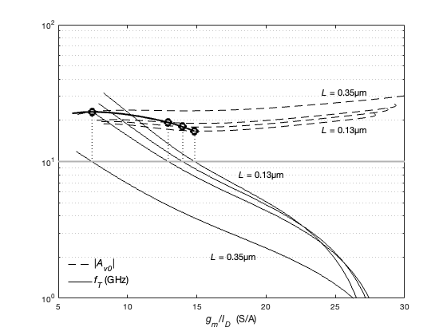

## IGS: sizing at constant $f_{T}$

Consider an IGS with $C_{L}$ = 1 pF and $f_{T}$=10 GHz. <br>
Find combinations of $L$ and $g_{m}/I_{D}$ that 1) maximize DC gain or 2) minimize current consumption.<br>

Sizing for constant $f_{T}$ is common in the case of amplifiers for which we want to achieve a fixed gain-bandwidth product, 
or in the case of cascode configurations, where is useful to size the common-gate device such that the non-dominant pole is above some given frequency.<br> 

#### matlab's design script (igs_ex3_3.m)
```
% File: igs_ex3_3.m
% source: Jesper and Murmann textbook
% example 3_3 pp. 73-77
% basic IGS - sizing at constant fT = 10GHz

clear all; clearvars; close all; clc;

addpath('~/ihome/class/gmidLUTs;~/ihome/class/gmidTECHs')
load ('sg13_lv_nmos.mat');

% specs
CL = 1e-12;
VSB = 0;
VDD = 1.2;
VDS = VDD/2;
FT = 10;      % (GHz)
FO = 10;      % rule of thumb: FO=fT/fu=CL/Cgg
fu = 1e9;     % (Hz)

%============ AV0 and fT vs. gm/ID for 4 values of L ========
% Approach based on fT contour with X = JD and Y = nch.L
JD = logspace(-9,-4.4,50);     % (A/µm) 
L  = [ .13 .16 .19 .35]';      % (µm)
Lvec = nch.L;                  % all values of L

% NOTE:
% make sure to define JD data points so that
% do not cause NaN in Av0, fT, gm_ID

% compute Av0, fT vs. gm_ID for 4 values of L
Av0 = look_up(nch,'GM_GDS','ID_W',JD,'L',L)';
fT  = 1e-9*look_up(nch,'GM_CGG','ID_W',JD,'L',L)'/(2*pi);
gm_ID = look_up(nch,'GM_ID','ID_W',JD,'L',L)';

% mark L
for k = 1:length(L)
    gmID1(k,1) = interp1(fT(:,k),gm_ID(:,k),FT);
    Av01(k)    = interp1(gm_ID(:,k),Av0(:,k),gmID1(k));
end

X1 = [5 30];   % gm/ID range to plot
Y1 = FT*[1 1]; % reference transit frequency 

% gm/ID and gain contours 
[X Y] = meshgrid(JD,Lvec);
figure(1);
[a1 b1] = contour(X,Y,1e-9*look_up(nch,'GM_CGG','ID_W',JD,...
    'L',Lvec)/(2*pi),FT*[1 1]);
JD1 = a1(1,2:end)';
Lx  = a1(2,2:end)';
gm_IDx = diag(look_up(nch,'GM_ID','ID_W',JD1,'L',Lx));
Avx = diag(look_up(nch,'GM_GDS','ID_W',JD1,'L',Lx));
z = FT*ones(4,1); 

% plot fT and gain vs. gm/ID for 4 values of L 
% mark the gain and gm/ID for which fT = 10GHz
% Jesper & Murmann fig. 3.10a
figure(2);
g1 = semilogy(gm_ID,Av0,'k--', 'linewidth',1); 
hold on;
g2 = semilogy(gm_ID,fT,'k','linewidth',1); 
semilogy(gmID1(:,ones(1,2))',[z Av01']','k:'); 
semilogy(X1,Y1, 'color', [0.7 0.7 0.7],'linewidth',2); 
semilogy(gm_IDx,Avx,'k','linewidth',2); 
semilogy(gmID1,Av01,'ko', 'linewidth',3,'markersize',8); 
xlabel({'{\itg_m}/{\itI_D}  (S/A)'},'fontsize',12);  
axis([5 30 1 100]);
set(gca, 'ygrid', 'on', 'yminorgrid', 'on');
legend([g1(1) g2(1)], {'|{\itA_v_0}|', '{\itf_T} (GHz)'}, ...
    'location', 'southwest','FontSize',12,'box','off');
text(24,32,'{\itL} = 0.35µm', 'fontsize',11);
text(24,17,'{\itL} = 0.13µm', 'fontsize',11);
text(18,8,'{\itL} = 0.13µm', 'fontsize',11);
text(16,2,'{\itL} = 0.35µm', 'fontsize',11);
hold off;

% plot gm/ID and gain vs. L for fT = 10GHz
% Jesper and Murmann Fig. 3.10b
figure(3);
semilogy(Lx,Avx,'k--',Lx,gm_IDx,'k','linewidth',1);
hold;
semilogy(L,Av01,'ok',L,gmID1,'ok','linewidth',1); 
axis([0.1 .45 5 30]); 
% set(gca, 'xgrid', 'on', 'ygrid', 'off', 'yminorgrid', 'off');
xlabel({'{\itL}  (µm)'}); 
legend('|{\itA_{V0}}|','{\itg_{m}/I_{D} (S/A)}', ...
    'fontsize',12,'box','off','location','best')
hold off;

% =========== constant fT = 10GHz locus =======================
% approach based on finding feasible pairs of (L, gm/ID) for which fT=10GHz
Lvec=0.13:0.01:3;
FTran = 1e10;
GMIDvec = look_up(nch,'GM_ID','GM_CGG',FTran*2*pi,'L',Lvec)';
% remove all unfeasible (gm/ID, L) pairs
GMIDfeas=GMIDvec(~isnan(GMIDvec));
N = length(GMIDfeas); % number of feasible (gm/ID, L) pairs
for index = 1:N
    Lfeas(index) = Lvec(index); 
end
% corresponding gain
for index = 1:N
AV0feas(index) = look_up(nch,'GM_GDS','GM_ID',GMIDfeas(index),'L',...
     Lfeas(index));
end
figure(4);
plot(Lfeas, GMIDfeas,'linewidth',1);
set (gca,'FontSize',12,'FontName','Helvetica');
xlabel('L (\mum)');
ylabel('G_m/I_D (S/A)')
title('Feasible ({\itL, G_m/I_D}) pairs - constant {\itf_T = 10GHz} locus',...
      'FontSize',14,'FontWeight','normal')

% plot gain vs. gm/ID at fT=10GHz
% option 1. design to maximize gain
figure(5);
plot(GMIDfeas,AV0feas,'LineWidth',1);
set (gca,'FontSize',12);
xlabel('G_m/I_D (S/A)');
ylabel('|A_{V0}| (V/V)');
optAV0 = max(AV0feas);
index_opt = find(AV0feas==optAV0);
optL = Lfeas(index_opt);
optGMID = GMIDfeas(index_opt);
optVGS = look_upVGS(nch,'GM_ID',optGMID,'L',optL);
optJD = look_up(nch,'ID_W','GM_ID',optGMID,'L',optL);
gm = 2*pi*fu*CL;
optID = gm/optGMID;
optW = optID/optJD;
str = ['max gain = ', num2str(optAV0, '%.2f'), ' (V/V)', newline, ...
    'L = ', num2str(optL,'%.2f'), ' (\mum)', newline, ...
    'G_m/I_D = ',num2str(optGMID,'%.2f'), ' (S/A)', newline, ...
    'V_{GS} = ',num2str(optVGS,'%.4f'), ' (V)', newline, ...
    'W = ',num2str(optW,'%.2f'), ' (\mum)', newline, ...
    'g_m = ', num2str(gm,'%.2e'), ' (S)', newline, ...
    'I_D = ', num2str(optID,'%.2e'), ' (A)'];
text(6,18, str, "FontSize",14);
hold on;
plot(optGMID,optAV0,'ko','linewidth',2)
hold off;
fprintf('\noption 1 - maximize DC gain:\n')
fprintf('Av0 = %.2f (V/V)\n',optAV0);
fprintf('gm/id = %.2f (S/A)\n',optGMID);
fprintf('L = %.2f (um)\n',optL);
fprintf('VGS = %.4f (V)\n',optVGS);
fprintf('W = %.2f (um)\n',optW);
fprintf('gm = %.2e (V)\n',gm);
fprintf('ID = %.2e (A)\n\n',optID);

%=============== gain vs. gm/ID at fT=10GHz ===================
% Approach based on fT contour with X = log10(JD) and Y = nch.L
% fT=10GHz
LL  = nch.L;
JDD = logspace(-9,-4.4,50); 
[X Y] = meshgrid(log10(JDD),LL);    
fT = look_up(nch,'GM_CGG','ID_W',JDD,'L',LL)/(2*pi); 
figure(6);
H1 = contour(X,Y,fT,FTran*[1 1]); 
JD = 10.^(H1(1,2:end));
L  = H1(2,2:end); 
gmID = diag(look_up(nch,'GM_ID','ID_W',JD,'L',L));
Avo  = diag(look_up(nch,'GM_GDS','ID_W',JD,'L',L)); 

% max gain
[a b] = max(Avo); % a is the max value in the Avo vector, b is its index
A1 = a;
L1 = L(b);
% min pow consumption 
gmIDmax = gmID(b); % value of gm/ID corresponding to max Avo
[c d] = max(gmID); % c is the max value in the gmID vector, d is its index
gmIDmin = gmID(d); % value of gm/ID corresponding to min ID
A2 = Avo(d);
L2 = L(d);

gm = 2*pi*fu*CL;
 
ID1 = gm/gmIDmax;
W1  = ID1/JD(b);
VGS1 = look_upVGS(nch,'ID_W',JD(b),'L',L1);

ID2 = gm/gmIDmin;
W2  = ID2/JD(d);
VGS2 = look_upVGS(nch,'ID_W',JD(d),'L',L2);

% plot gain vs. gm/ID at fT=10GHz 
% Jesper and Murmann: fig. 3.11a
% mark maximum gain and minimum current options
figure;
plot(gmID,Avo,'k',gmID(b),A1,'ko',gmID(d),Avo(d),'k*','linewidth',1); 
axis([2 16 12 24]);
text(6.5,22.5, ['( ',num2str(gmID(b),'%.2f'),' , ',...
    num2str(A1,'%.2f'), ')'], 'fontsize',12);
text(13,16, ['( ',num2str(gmID(d),'%.2f'),' , ',...
    num2str(Avo(d),'%.2f'), ')'], 'fontsize',12);
% grid 
xlabel({'{\itg_m}/{\itI_D} (S/A)'},'fontsize',12);
ylabel('{\itA_v_o}','FontSize',12);


% plot L vs. gm/ID at fT=10GHz 
% jesper and Murmann fig. 3.11b
% mark maximum gain and minimum current options
figure;
plot(gmID,1e3*L,'k',gmID(b),1e3*L1,'ko',gmID(d),1e3*L2,'*k','linewidth',1)
% grid 
xlabel({'{\itg_m}/{\itI_D}  (S/A)'},'fontsize',12);
ylabel('{\itL}  (nm)','FontSize',12);
text(8,350, ['( ',num2str(gmID(b),'%.2f'),' , ',...
    num2str(1e3*L1,'%.2f'), ')'], 'fontsize',12);
text(12.2,130, ['( ',num2str(gmID(d),'%.2f'),' , ',...
    num2str(1e3*L2,'%.2f'), ')'], 'fontsize',12);

fprintf('\noption 1 - maximize DC gain: \n')
fprintf('Av0 = %.2f; gm/ID = %.2f (S/A); L= %.2f (um); VGS = %.4f; ', ...
    A1, gmIDmax, L1, VGS1)
fprintf('W = %.2f (um); gm = %.2e; ID = %.2e\n', W1, gm, ID1);

fprintf('option 2 - minimize current: \n')
fprintf('Av0 = %.2f; gm/ID = %.2f (S/A); L= %.2f (um); VGS = %.4f; ', ...
    A2, gmIDmin, L2, VGS2)
fprintf('W = %.2f (um); gm = %.2e; ID = %.2e\n', W2, gm, ID2);

%========== gain and device width vs. current ==============
% Approach based on fT contour with X = nch.VGS and Y = nch.L
% FT = 10;
% LL  = nch.L
fT  = look_up(nch,'GM_CGG','L',LL)/(2*pi); 
[X Y] = meshgrid(nch.VGS,LL);
figure;
H1  = contour(X,Y,fT/1e9,FT*[1 1]); 
VGS = H1(1,2:end);
L   = H1(2,2:end);
gmID = diag(look_up(nch,'GM_ID','VGS',VGS,'L',L));
Avo = diag(look_up(nch,'GM_GDS','VGS',VGS,'L',L)); 
JD  = diag(look_up(nch,'ID_W','VGS',VGS,'L',L)); 

% max gain
[a b] = max(Avo);
A1 = a;
L1 = L(b);
gmIDmax = gmID(b);
VGS1 = VGS(b);

% min pow consumption   
[c d] = max(gmID); 
gmIDmin = gmID(d);
A2 = Avo(d);
L2 = L(d);
VGS2 = VGS(d);
   
% de-norm
gm = 2*pi*fu*CL;
ID = gm./gmID;
W  = ID./JD;

ID1 = ID(b);
W1  = ID1/JD(b); 

ID2 = ID(d);
W2  = ID2/JD(d) ;
    
% plot gain and device width vs. current
% Jesper and Murmann Fig. 3.12
% mark maximum gain and minimum current options
figure;
plot(1e3*ID,Avo,'k--',1e3*ID(b),A1,'ko',...
    1e3*ID(d),Avo(d),'k*',...
    1e3*ID,W,'k',1e3*ID(b),W(b),'ko',1e3*ID2,W2,'k*','linewidth',1.05); 
axis([0 3 0 80]); 
% grid;   
xlabel('{\itI_D}   (mA)','FontSize',12);
legend('|A_{V0}|','','','W (\mum)','fontsize',12,'box','off')
text(0.2,70, ['( ',num2str(ID2,'%.2e'),' , ',...
    num2str(W2,'%.2f'), ')'], 'fontsize',12);
text(1,30, ['( ',num2str(ID1,'%.2e'),' , ',...
    num2str(W1,'%.2f'), ')'], 'fontsize',12);
text(0.2,13, ['( ',num2str(ID2,'%.2e'),' , ',...
    num2str(A2,'%.2f'), ')'], 'fontsize',12);
text(0.6,19, ['( ',num2str(ID1,'%.2e'),' , ',...
    num2str(A1,'%.2f'), ')'], 'fontsize',12);

fprintf('\noption 1 - maximize DC gain: \n')
fprintf('Av0 = %.2f; gm/ID = %.2f (S/A); L= %.2f (um); VGS = %.4f; ', ...
    A1, gmIDmax, L1, VGS1)
fprintf('W = %.2f (um); gm = %.2e; ID = %.2e\n', W1, gm, ID1);

fprintf('option 2 - minimize current: \n')
fprintf('Av0 = %.2f; gm/ID = %.2f (S/A); L= %.2f (um); VGS = %.4f; ', ...
    A2, gmIDmin, L2, VGS2)
fprintf('W = %.2f (um); gm = %.2e; ID = %.2e\n', W2, gm, ID2);
```

<p align="center">
   
</p>
<p align="center">
Fig. Transit frequency $f_{T}$ and DC gain $A_{v0}$ versus $g_{m}/I_{D}$ for various L
