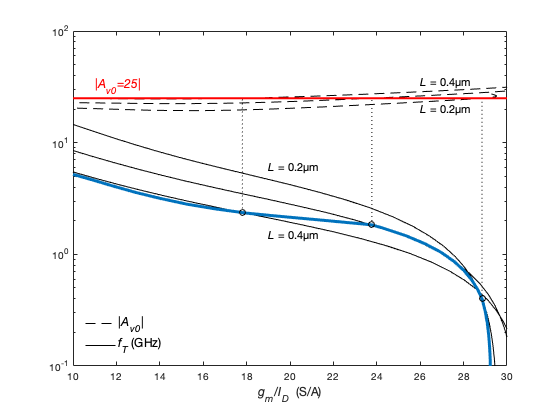
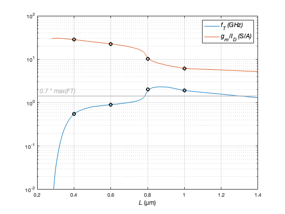
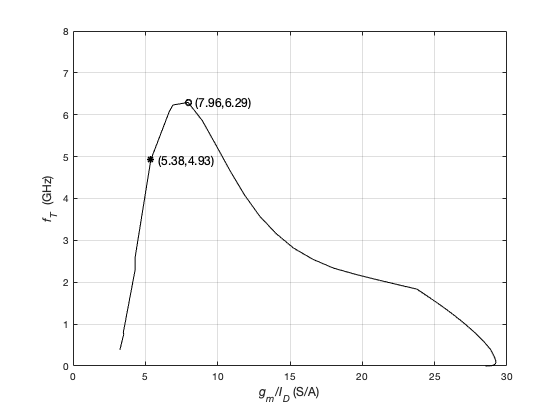
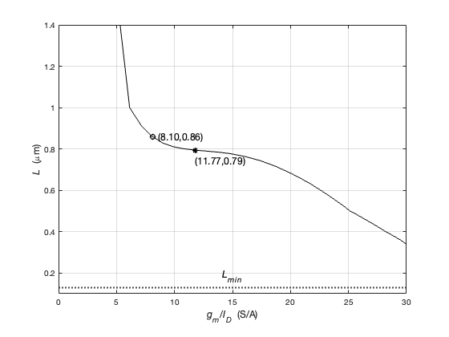
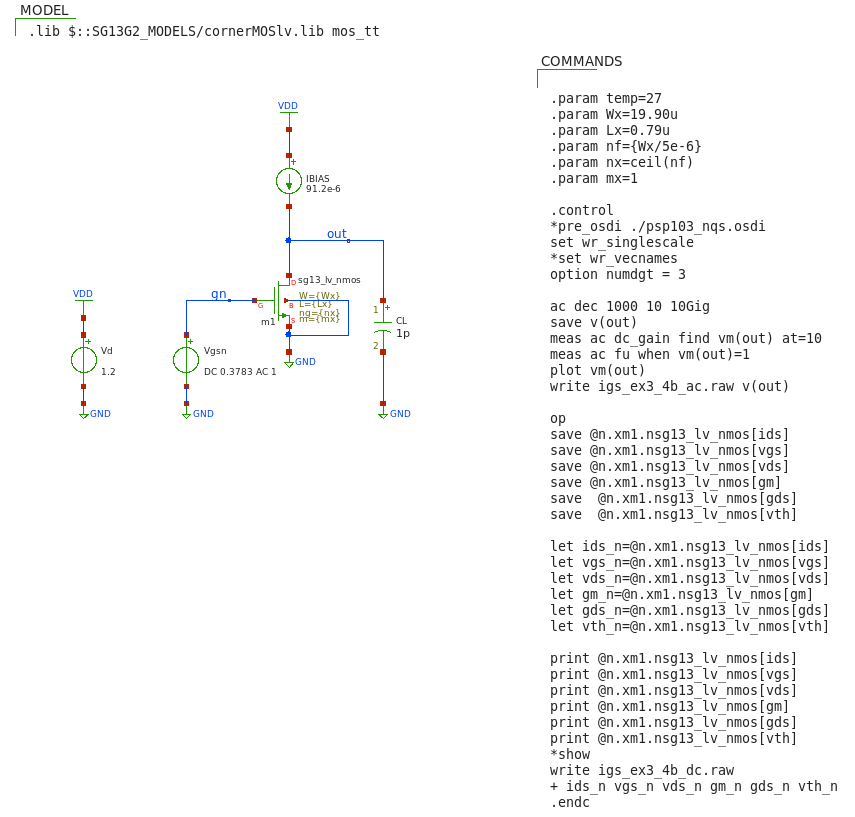

## IGS: sizing at constant $|A_{V0}|$

Consider an IGS with $C_{L}$ = 1 pF and constant $|A_{V0}|$=30. <br>
Find combinations of $L$ and $g_{m}/I_{D}$ that 1) maximize unity gain frequency or 2) minimize current consumption<br>
and achieves at least 70% of the maximum unity gain frequency.

Sizing for constant $|A_{V0}|$ is common when designing operational amplifiers to be used in circuits for which we want<br>
a certain target feedback loop gain. <br> 

#### matlab's design script (igs_ex3_4.m)
```
% File: igs_ex3_4.m
% source: Jesper and Murmann textbook
% example 3_4 pp. 77-79
% basic IGS - sizing at constant |Av0| = 30

clear all; clearvars; close all; clc;

addpath('~/ihome/class/gmidLUTs;~/ihome/class/gmidTECHs')
load ('sg13_lv_nmos.mat');

% specs
CL = 1e-12;
VSB = 0;
VDD = 1.2;
VDS = VDD/2;
Aref = 30;

% How can we find out an adequate logspace for JD ?
% The JD data points must be defined so that they
% do not cause NaN in Av0, fT, gm_ID
ID_W = look_up(nch,'ID_W','VGS',nch.VGS,'L',nch.L)';
[a b] = size(ID_W);
[minJD,maxJD] = bounds(ID_W,"all");
HB = log10(maxJD)  % must "tweak" to avoid NaN
LB = log10(minJD)  % must "tweak" to avoid NaN
% The range is technology-dependent and requires some trial and error
% To better understand how to derive the JD range see J&M's Fig. 3.15 
% and associated script


%============ AV0 and fT vs. gm/ID for 3 values of L ========
% JD = logspace(LB+2,HB-1,50); 
JD = logspace(-9,-4.4,50);   % empirical

L  = [.4 .6 .8 1.0]';        % (µm)

Av0 = look_up(nch,'GM_GDS','ID_W',JD,'L',L)';
fT  = 1e-9*look_up(nch,'GM_CGG','ID_W',JD,'L',L)'/(2*pi);
gm_ID  = look_up(nch,'GM_ID','ID_W',JD,'L',L)';

% mark the L
for k = 1:length(L)
    gmID1(k,1) = interp1(Av0(:,k),gm_ID(:,k),Aref);
    fT1(k)  = interp1(gm_ID(:,k),fT(:,k),gmID1(k));
end

% reference gain (used to draw a reference line on plot)
X1 = [0 30]; 
Y1 = Aref*[1 1];

% const Aref contour with X = JD and Y = nch.L
[X Y] = meshgrid(JD,nch.L);
[a1 b1] = contour(X,Y,look_up(nch,'GM_GDS','ID_W',JD,'L',nch.L),Aref*[1 1]);
JD1 = a1(1,2:end)';
Lx  = a1(2,2:end)';
gm_IDx = diag(look_up(nch,'GM_ID','ID_W',JD1,'L',Lx));
fTx = 1e-9*diag(look_up(nch,'GM_CGG','ID_W',JD1,'L',Lx))/(2*pi);
z   = Aref*ones(1,4); 

% Plot 
h = figure(1);
g1 = semilogy(gm_ID,Av0,'k--', 'linewidth', 1);
hold;
semilogy((gmID1*[1 1])',[fT1; z],'k:');
g2 = semilogy(gm_ID,fT,'k', 'linewidth', 1);
semilogy(X1,Y1,'color', 'red','linewidth',2);
text(6,40,['{\it|A_v_0|=}', num2str(Aref,'%.0f')],...
    'FontSize',12,'Color','red');
semilogy(gm_IDx,fTx,'color',"#0072BD",'linewidth',3);
semilogy(gmID1,fT1,'ko','linewidth',1);
xlabel({'{\itg_m}/{\itI_D}  (S/A)';''},'fontsize',12);  
axis([5 30 0.1 100]);
legend([g1(1) g2(1)], {'|{\itA_v_0}|', '{\itf_T} (GHz)'}, 'location', ...
    'southwest','fontsize',12,'Box','off');
text(25,22,'{\itL} = 0.4µm','fontsize',11)
text(25,45,'{\itL} = 1.0µm','fontsize',11)
text(15,4,'{\itL} = 0.4µm','fontsize',11)
text(15,0.4,'{\itL} = 1.0µm','fontsize',11)

k = figure(2);
semilogy(Lx,fTx, Lx,gm_IDx,'linewidth',1); 
hold;
semilogy(L,fT1,'ok',L,gmID1,'ok','linewidth',2); 
yl = yline(0.7*max(fT1),'-','{\it0.7 * max(FT)}','color',[0.7 0.7 0.7], ...
    'linewidth',2,'fontsize',12); 
yl.LabelHorizontalAlignment = 'left';
xlabel({'{\itL} (µm)';''},'fontsize',12);
axis([0.2 1.4 .01 100]); 
grid;
set(gca, 'yminorgrid', 'on');
legend('{\itf_T (GHz)}','{\itg_m}/{\itI_D (S/A)}','fontsize',12)

% == i. maximum fT design and ii. minimum current design for a 30% fT loss
% The value pair (gm/ID, L) that maximizes fT is the same point that
% maximize also fu (fu = fT/FO = fT/10)
[fTmax idxmax] = max(fTx)
idx2 = max(find(fTx>=0.7*fTmax,1));  

h1 = figure(3);
plot(gm_IDx,fTx,'k-', 'linewidth', 1)
hold;
plot(gm_IDx(idxmax),fTmax,'ko', gm_IDx(idx2), fTx(idx2),'k*',...
    'linewidth',1.5); 
axis([0 30 0 3]); 
grid; 
xlabel({'{\itg_m}/{\itI_D} (S/A)'; ''},'fontsize',12);
ylabel('{\itf_T}  (GHz)','fontsize',12);
text(gm_IDx(idx2)+0.5, fTx(idx2),['(',num2str(gm_IDx(idx2),'%.2f'),...
    ',',num2str(fTx(idx2),'%.2f'),')'],'fontsize',12)
text(gm_IDx(idxmax)+0.5, fTx(idxmax),['(',num2str(gm_IDx(idxmax),'%.2f'),...
    ',',num2str(fTx(idxmax),'%.2f'),')'],'fontsize',12)

k1 = figure(4);
plot(gm_IDx,Lx,'k-', 'linewidth', 1)
hold;
plot(gm_IDx(idxmax),Lx(idxmax),'ko', gm_IDx(idx2), Lx(idx2),'k*',...
    'linewidth',1.5); 
line = yline(0.13,':','{\itL_m_i_n}','color','black',...
    'linewidth',2,'fontsize',12)
line.LabelHorizontalAlignment = 'center';
axis([0 30 0.1 1.4]); 
grid; 
xlabel({'{\itg_m}/{\itI_D}  (S/A)'; ''},'fontsize',12);
ylabel('{\itL}  (\mum)','fontsize',12);
text(gm_IDx(idx2), Lx(idx2)-0.05,['(',num2str(gm_IDx(idx2),'%.2f'),...
    ',',num2str(Lx(idx2),'%.2f'),')'],'fontsize',12)
text(gm_IDx(idxmax)+0.5, Lx(idxmax),['(',num2str(gm_IDx(idxmax),...
    '%.2f'),',',num2str(Lx(idxmax),'%.2f'),')'],'fontsize',12)

% option 1: maximize fu
FO = 10; % fanout
L1  = Lx(idxmax);
fu1 = 1e9*fTmax/FO;
gm1 = 2*pi*fu1*CL;
ID1 = gm1/gm_IDx(idxmax);
W1 = ID1/JD1(idxmax);
VGS1 = look_upVGS(nch,'GM_ID',gm_IDx(idxmax),'L',Lx(idxmax));

% option 2: minimize current consumption (30% fT reduction)
L2 = Lx(idx2);
fu2 = 1e9*fTx(idx2)/FO;
gm2 = 2*pi*fu2*CL;
ID2 = gm2/gm_IDx(idx2);
W2 = ID2/JD1(idx2);
VGS2 = look_upVGS(nch,'GM_ID',gm_IDx(idx2),'L',Lx(idx2));

% ========= Results
fprintf('\noption 1: maximize fT \n')
fprintf('Av0 = %.0f; gm/ID = %.2f (S/A); ID = %.2e (A); VGS = %.4f (V); ',...
    Aref, gm1/ID1, ID1, VGS1)
fprintf('fu = %.2e (Hz); L = %.2f (um); W = %.2f (um); \n', fu1, L1, W1);

fprintf('\noption 2: minimize current (30 percent fT reduction)\n')
fprintf('Av0 = %.0f; gm/ID = %.2f (S/A); ID = %.2e (A); VGS = %.4f (V); ',...
    Aref, gm2/ID2, ID2, VGS2)
fprintf('fu = %.2e (Hz); L = %.2f (um); W = %.2f (um); \n', fu2, L2, W2);
```

<p align="center">
   
</p>
<p align="center">
<b>Figure 3.13 (a)</b> Transit frequency $f_{T}$ and DC gain $|A_{v0}|$ versus $g_{m}/I_{D}$ for four values of L

<p align="center">
   
</p>
<p align="center">
<b>Figure 3.13 (b)</b> $f_T$ and $g_{m}/I_{D}$ versus $L$ at $|A_{v0}|=30$

<p align="center">
   
</p>
<p align="center">
<b>Figure 3.14 (a) </b> Transit frequency $f_{T}$ vs. $g_{m}/I_{D}$ at $|A_{v0}|=30$<br>
The circles mark the design parameters that maximize $f_u$<br>
The asterisks mark the design parameters that minimize current for a 30% reduction of the $f_u$
<p align="center">
   
</p>
<p align="center">
<b>Figure 3.14 (b) </b> gate length $L$ vs. $g_{m}/I_{D}$ at $|A_{v0}|=30$<br>
The circles mark the design parameters that maximize $f_u$<br>
The asterisks mark the design parameters that minimize current for a 30% reduction of the $f_u$


**Summary of Design Parameters**<br>
*option 1: maximize unity gain frequency fu*<br> 
Av0 = 30; gm/ID = 8.10 (S/A); ID = 1.80e-04 (A); VGS = 0.4708 (V); fu = 2.32e+08 (Hz); L = 0.86 (um); W = 16.53 (um); 

*option 2: minimize current (30% fu reduction)*<br>
Av0 = 30; gm/ID = 11.77 (S/A); ID = 9.12e-05 (A); VGS = 0.3782 (V); fu = 1.71e+08 (Hz); L = 0.79 (um); W = 19.90 (um); 

#### Xschem/NGspice simulation setup to verify the design (igs_ex3_4a.sch) - option 1
<p align="center">
   
</p>

#### Simulation Results - option 1
dc_gain             =  37.89 V/V<br>
fu                  =  0.2246 GHz<br>
ID                  =  1.800e-04 A<br>
VGS                 =  0.4708 V<br>
VDS                 =  0.8395 V<br>
gm                  =  1.425e-03 S<br>
gds                 =  3.760e-05 S<br>
gm/ID               =  7.9167 S/A

#### Xschem/NGspice simulation setup to verify the design (igs_ex3_4b.sch) - option 2
<p align="center">
   
</p>

#### Simulation Results - option 2
dc_gain             =  30.28 V/V<br>
fu                  =  0.166 GHz<br>
ID                  =  9.120e-05 A<br>
VGS                 =  0.3783 V<br>
VDS                 =  0.5978 V<br>
gm                  =  1.054e-03 S<br>
gds                 =  3.480e-05 S<br>
gm/ID               =  11.5570 S/A
