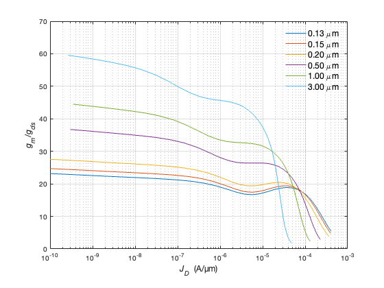

## Sizing in weak inversion

In weak inversion ($(g_{m}/I_{D})_{max}$ is nearly constant irrespective of L.

weak inversion $\leftrightarrow$ large $g_{m}/I_{D}$ $\leftrightarrow$ small $V_{GS}$

Once the transistor enters weak inversion, $g_{m}/I_{D}$ no longer uniquely defines the drain current density $J_D$. In other words, a wide range of current densities map to nearly the same value of $g_{m}/I_{D}$, so the transconductance efficiency ($g_{m}/I_{D}$) is no longer a good proxy to 
optimize a design. **The proxy to use is the current density $J_D$.** <br>
In weak inversion, the intrinsic gain increases significantly with gate length L, so the choice of L follows directly from the gain requirement.<br>
In addition, we do not need to worry about fan-out because the ratios of $f_T$ and $f_u$ will almost always be larger than the desired bound of 10.

<p align="center">
   
</p>
<p align="center">
<b>Figure 3.15 </b> Tranconductance efficiency ($g_{m}/I_{D}$) vs. drain current density ($J_{D}$) for nMOS with L = 0.13, 0.15, 0.20, 0.50, 1.00, 3.00 $\mu m$ <br>

<p align="center">
   
</p>
<p align="center">
<b>Figure 3.16 (a) </b> Intrinsic gain ($g_{m}/g_{ds}$) vs. drain current density ($J_{D}$) for nMOS with L = 0.13, 0.15, 0.20, 0.50, 1.00, 3.00 $\mu m$ <br>

<p align="center">
   
</p>
<p align="center">
<b>Figure 3.16 (b) </b> Transient frequency ($f_{T}$) vs. drain current density ($J_{D}$) for nMOS with L = 0.13, 0.15, 0.20, 0.50, 1.00, 3.00 $\mu m$ <br>

```
% source Jesper and Murmann
% Fig 3.15 Sizing in weak inversion: 
% gm/ID versus JD
% gm_gds versus JD
% fT versus JD
clear all
close all

addpath('~/ihome/class/gmidLUTs;~/ihome/class/gmidTECHs')
load ('sg13_lv_nmos.mat');

% data ==============
L = [0.13 0.15 0.2 0.5 1 3];   % (µm)

% compute =================
JD     = look_up(nch,'ID_W','VGS',nch.VGS,'L',L); % note the sweep of VGS
gm_ID  = look_up(nch,'GM_ID','VGS',nch.VGS,'L',L);
gm_gds = look_up(nch,'GM_GDS','VGS',nch.VGS,'L',L);
fT     = look_up(nch,'GM_CGG','VGS',nch.VGS,'L',L)/2/pi;

% plot ====================
h = figure(1);
semilogx(JD', gm_ID','linewidth',1); 
grid; 
axis([1e-10 1e-3 5 35]);
ylabel('{\itg_m}/{\itI_D}  (S/A)','fontsize',12);
xlabel('{\itJ_D}  (A/µm)','FontSize',12);
legend('0.13 \mum','0.15 \mum', '0.20 \mum', '0.50 \mum', '1.00 \mum', ...
    '3.00 \mum','fontsize',12,'box','off')

k = figure(2);
semilogx(JD', gm_gds','linewidth',1);  
grid; 
axis([1e-10 1e-3 0 70]);
xlabel({'{\itJ_D}  (A/µm)'; ''},'fontsize',12);
ylabel('{\itg_m}/{\itg_d_s}','FontSize',12);
legend('0.13 \mum','0.15 \mum', '0.20 \mum', '0.50 \mum', '1.00 \mum', ...
    '3.00 \mum','fontsize',12,'box','off')

j = figure(3);
loglog(JD', fT','linewidth',1);  
grid; 
axis([1e-11 1e-3 1e4 1e11]);
xlabel({'{\itJ_D}  (A/µm)'; ''},'fontsize',12);
ylabel('{\itf_T}  (Hz)','FontSize',12);
legend('0.13 \mum','0.15 \mum', '0.20 \mum', '0.50 \mum', '1.00 \mum', ...
    '3.00 \mum','fontsize',12,'box','off','location','northwest')
```
