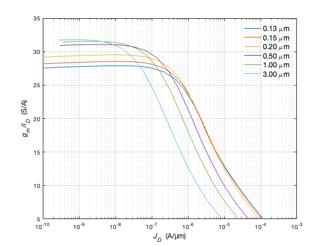

## Sizing in weak inversion

In weak inversion ($(g_{m}/I_{D})_{max}$ is nearly constant irrespective of L.

weak inversion $\leftrightarrow$ large $g_{m}/I_{D}$ $\leftrightarrow$ small $V_{GS}$

Once the transistor enters weak inversion, $g_{m}/I_{D}$ no longer uniquely defines the drain current density $J_D$. In other words, a wide range of current densities map to nearly the same value of $g_{m}/I_{D}$, so the transconductance efficiency ($g_{m}/I_{D}$) is no longer a good proxy to 
optimize a design. **The proxy to use is the current density $J_D$.** <br>
In weak inversion, the intrinsic gain increases significantly with gate length L, so the choice of L follows directly from the gain requirement.<br>
In addition, we do not need to worry about fan-out because the ratios of $f_T$ and $f_u$ will almost always be larger than the desired bound of 10.

<p align="center">
   
</p>
<p align="center">
<b>Figure 3.15 </b> Tranconductance efficiency ($g_{m}/I_{D}$) vs. drain current density ($J_{D}$) for nMOS with L = 0.13, 0.15, 0.20, 0.50, 1.00, 3.00 um<br>

```
```
