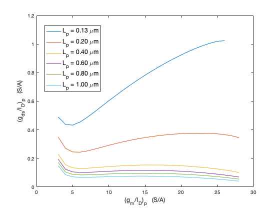
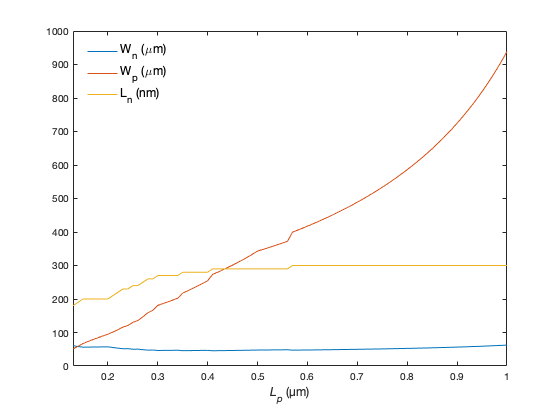
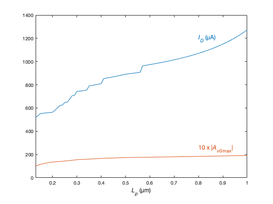
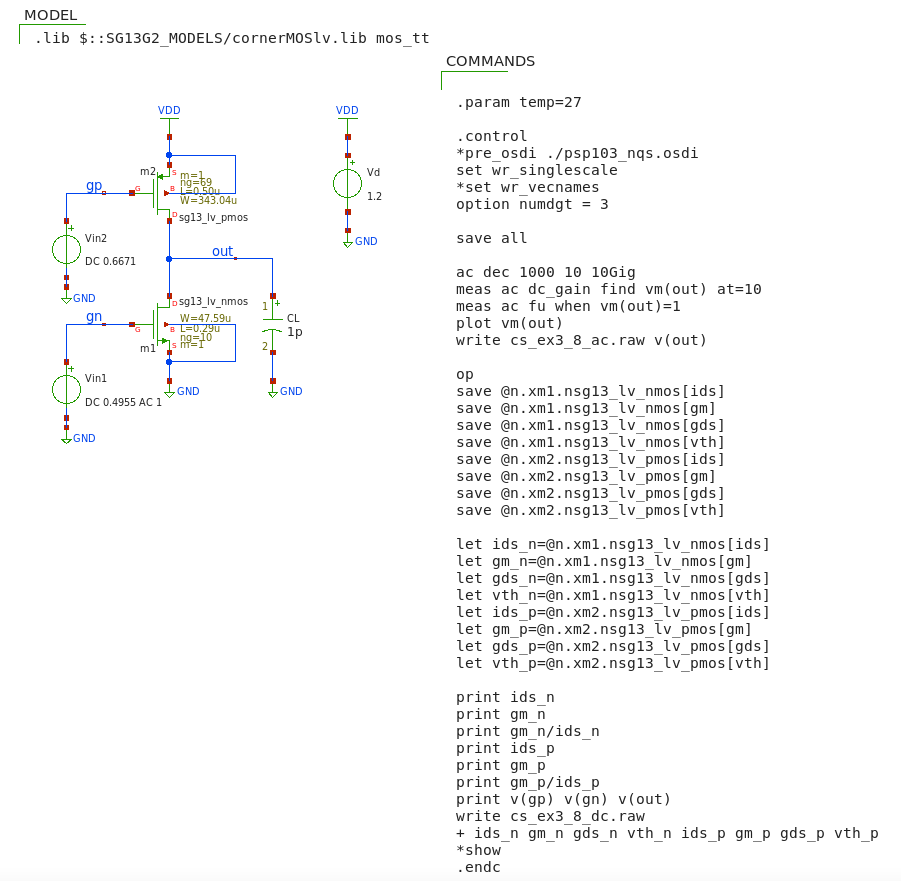

## Sizing a CS stage with active load

Consider a common source with a p-channel load. Assume $C_{L}$ = 1 pF, $f_{T}$=10 GHz and FO = 10 ( $\leftrightarrow$ $f_u$ = 1 GHz). <br>
Find combinations of $L_n$ and $(g_{m}/I_{D})_{n}$ that maximize the DC gain $Av_0$ and evaluate the impact of $L_p$.

<p align="lect">
$A_{v0}$ = $-$ $\dfrac{\left( \dfrac{g_m}{I_D} \right)_n}{\left( \dfrac{g_{ds}}{I_D} \right)_n \;+ \; \left( \dfrac{g_{ds}}{I_D} \right)_p }$
</p>

---

To maximize the gain we should make $(g_{ds}/I_D)_p$ as small as possible (i.e., the p-channel transistor should operate in strong inversion).
However, strong inversion means large drain saturation voltage, and therefore loss of output signal swing.

To avoid excessive loss of output dynamics assume $V_{DsatP} \leq 0.2 V$  

$V_{DsatP} = \dfrac{2}{(g_m/I_D)_p}$ $\leftrightarrow$  $({g_m}/{I_D})_p \geq 10 \ S/A $

---

#### matlab's design script (cs_ex3_8.m - part 1)
```
% File: cs_ex3_8.m
% source: Jesper and Murmann textbook
% example 3_8 pp. 95-98
% design of CS with active p-channel transistor load

clear all; clearvars; close all; clc;

addpath('~/ihome/class/gmidLUTs;~/ihome/class/gmidTECHs')
load ('sg13_lv_nmos.mat');
load ('sg13_lv_pmos.mat');

% specs
CL = 1e-12;
VSB = 0;
VDD = 1.2;
VDS = VDD/2;
FT = 10e9;
FO = 10;
fu = FT/FO;

% ============= PART 1 ================

% Gaining intuition about the impact of L2
% == data
L2 = [0.13 .2*(1:5)];  % L = [0.13 0.2 0.4 0.6 0.8 1.0] um 
gm_ID2 = 3:28;  % (S/A)
% == compute
gds_ID2 = look_up(pch,'GDS_ID','GM_ID',gm_ID2,'L',L2);
% == plot
h = figure(1);
plot(gm_ID2,gds_ID2,'linewidth',1); 
grid off;
xlabel('({g_m}/{I_D})_p   (S/A)','FontSize',12);
ylabel('({g_d_s}/{I_D})_p   (S/A)','fontsize',12);
% "automate" the creation of the legend
for i=1:length(L2)
   legstr{i} = ['L_p = ',num2str(L2(i),'%.2f'),' \mum'];
end
legend(legstr,'location','best','fontsize',12,'box','on');
```

<p align="center">
   
</p>
<p align="center">
<b>Figure 3.24 </b> $(g_{ds}/I_{D})_p$ vs. $(g_{m}/I_D)_p$ for various L <br>

---

To size the CS we begin with the IGS "associated" to the n-channel transistor.

We sweep a suitable range of $L_{n}$ and compute the corresponding $(g_m/I_D)_n$ vector to achieve the required transient frequency $f_T$. 

This procedure also provides the corresponding $(g_{ds}/I_D)_n$ 

Next, we perform a similar sweep of $L_p$ which lets us compute $(g_{ds}/I_{D})_p$  and $Avo$. 

We search for the largest $L_{p}$ that allows us to still meet the desired $f_T$.

---

#### matlab's design script (cs_ex3_8.m - part 2)
```
% ============= PART 2 ================

% sweep L1
L1 = [min(nch.L):0.01:max(nch.L)];
gm_ID1 = look_up(nch,'GM_ID','GM_CGG',2*pi*FT,'L',L1);
% remove the values of gm_ID1 and the corresponding L1 for which the 
% required FT is not achievable (i.e., remove the NaN from the vectors)
gm_ID1 = gm_ID1(~isnan(gm_ID1));
L1 = L1(1:length(gm_ID1));
gds_ID1 = diag(look_up(nch,'GDS_ID','GM_ID',gm_ID1,'L',L1));

% set the gm_ID2 so that VDsatp is not larger than 0.2V 
gm_ID2 = 10; % gm_ID2 should not drop below 10 S/A

% search for the largest L2 that enables us to still meet the desired fu
% sweep L2
L2 = [min(pch.L):0.01:max(pch.L)];
gds_ID2 = look_up(pch,'GDS_ID','GM_ID',gm_ID2,'L',L2);
for k = 1:length(L2)
     Av0(:,k) = gm_ID1./(gds_ID1 + gds_ID2(k));
end
% AV0 is a matrix of dimension L1 x L2
% length(L1) = 41
% length(L2) = 288
% size(Av0)  = 41 288
[a b] = max(Av0);
maxgain = a';
% L1(b) gate lengths of M1 making Av0 max
% gm_ID1(b);


% == denormalize while accounting for self loading
Cself = 0;
for k = 1:10
      gm = 2*pi*fu*(CL+Cself); % gm_1
      ID = gm./gm_ID1(b);
      W1 = ID./diag(look_up(nch,'ID_W','GM_ID',gm_ID1(b),'L',L1(b)));
      W2 = ID./look_up(pch,'ID_W','GM_ID',gm_ID2,'L',L2);
      Cdd2 = W2.*look_up(pch,'CDD_W','GM_ID',gm_ID2,'L',L2); 
      Cdd1 = W1.*diag(look_up(nch,'CDD_W','GM_ID',gm_ID1(b),'L',L1(b)));  
      Cself = Cdd1 + Cdd2; 
end

% plot ==========================
k = figure(2);
ax = plot(L2,[W1(:,end) W2(:,end) 1e3*L1(b)']);
xlim([0.13 1])
xlabel({'{\itL_p} (µm)',''},'fontsize', 12)
legend('W_n (\mum)', 'W_p (\mum)','L_n (nm)','location','best',...
    'fontsize',12,'box','off')

m = figure(3);
ax = plot(L2,[1e6*ID 10*maxgain]);
xlim([0.13 1])
xlabel({'{\itL_p} (µm)',''},'fontsize', 12)
text(.8,1200,'{\itI_D} (µA)','fontsize', 12,'Color',"#0072BD")
text(.8,250,'10 x |{\itA_v_0_m_a_x}|','fontsize', 12,'Color',"#D95319")

% [maxgain ID gm_ID1 L1 W1 W2] @ L2 = 0.5um
recap = interp1(L2,[maxgain 1e6*ID gm_ID1(b) L1(b)' W1 W2],.5);

VG1 = look_upVGS(nch,'GM_ID',recap(3),'L',recap(4)); % don't forget L !!!
VGS2 = look_upVGS(pch,'GM_ID',gm_ID2,'L',0.5);       % don't forget L !!!
VG2 = VDD - VGS2;

fprintf("------------- Results --------------\n")
fprintf("|Av0| = %.2f\n",recap(1));
fprintf("(gm/ID)_p = %.2f S/A\n",gm_ID2)
fprintf("(gm/ID)_n = %.2f S/A\n",recap(3));
fprintf("ID = %.2f uA\n",recap(2));
fprintf("VG_p = %.4f V\n",VG2)
fprintf("L_p = %.2f um\n",0.5)
fprintf("W_p = %.2f um\n",recap(6))
fprintf("VG_n = %.4f V\n",VG1)
fprintf("L_n = %.2f um\n",recap(4))
fprintf("W_n = %.2f um\n",recap(5))
fprintf("-------------------------------------\n")
```

<p align="center">
   
</p>
<p align="center">
<b>Figure 3.25 (a) </b> Device Geometries <br>

<p align="center">
   
</p>
<p align="center">
<b>Figure 3.25 (b) </b> Drain current $I_D$ and maximum gain $|A_{V0}|_{max}$ vs. gate length $L_p$ the p-channel load. <br>

---

To first order $I_D$ is fixed by the n-channel transistor $M_n$. However, as the self-loading increases with larger $L_p$ , a larger $gm_n$ is needed to maintain the desired unity gain frequency $f_u$. 

**Fig. 3.25a** and **Fig. 3.25b** show that there is no reason to push $L_p$ beyond 0.5 $\mu m$ since the gain doesn't increase appreciably but the width of the load transistor $W_p$ grows rapidly and so does the drain current $I_D$.

---

#### Summary of design parameters

``|Av0| = 17.39 ``<br>
``(gm/ID)_p = 10.00 S/A ``<br>
``(gm/ID)_n = 9.25 S/A ``<br>
``ID = 891.49 uA ``<br>
``VG_p = 0.6671 V ``<br>
``L_p = 0.50 um ``<br>
``W_p = 343.04 um ``<br>
``VG_n = 0.4955 V ``<br>
``L_n = 0.29 um ``<br>
``W_n = 47.59 um ``<br>

#### Xschem/NGspice simulation setup to verify the design (CS_ex3_8.sch)
<p align="center">
   
</p>

**NOTE:** In the practical setup the gate voltages are computed using replica circuits rather than fixed DC voltages (this way $V_{OUT}$ is closer to the desired value of $V_{DD}/2$).   

#### Simulation Results

``|Av0| = 17.39 ``<br>
``f_u = 1.08 GHz`` <br>
``(gm/ID)_p = 10.00 S/A ``<br>
``(gm/ID)_n = 9.22 S/A ``<br>
``ID = 892.2 uA ``<br>
``VG_p = 0.6671 V ``<br>
``VG_n = 0.4955 V `` <br>
``V_OUT = 0.5935 V`` <br>

#### Comparing the design and the simulation

<p align="left">
% Error = $\dfrac{True \; value-Expected \;value}{True \;value}$ $\times 100$
</p>

% Error on $V_{OUT}$ : 100*(0.5935 - 0.6)/0.5935 =  -1.10 %

% Error on $A_{vo}$ : 100*(17.39-17.39)/17.39 = 0 %

% Error on $(g_{m}/I_{D})_n$ : 100*(9.22-9.25)/9.22 = -0.33 %

% Error on $(g_{m}/I_{D})_p$ : 100*(10-10)/10 = 0 %

% Error on $I_{D}$ : 100*(892.2-891.49)/892.2 = 0.08 %

<br>*The design using the LUTs is right on target!*
<p align="left">
   
</p
