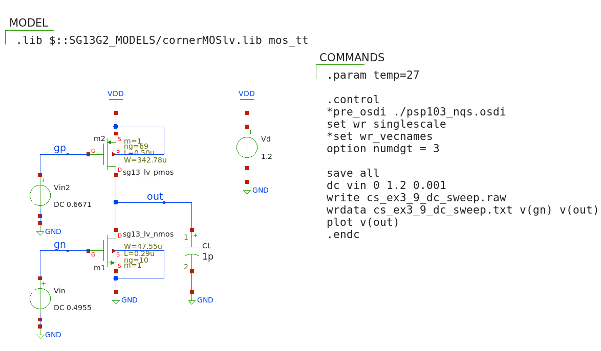

## Large signal characteristic of CS stage with active load

The DC transfer characteristic ($v_{OUT}$ vs. $v_{IN}$) allows to assess the available output voltage swing.

---

#### matlab's design script (CS_ex3_9.m - part 1)
```
% File: cs_ex3_9.m
% source: Jesper and Murmann textbook
% example 3_9 pp. 98-99
% large signal characteristic of CS with active p-channel load

% ================== PART 1 ===============================

clear all
close all
clc
addpath('~/ihome/class/gmidLUTs;~/ihome/class/gmidTECHs')

load ('sg13_lv_nmos.mat');
load ('sg13_lv_pmos.mat');

% specs ===========
VDD = 1.2;
CL  = 1e-12;
fT = 10e9; 
FO = 10;

gm_ID2 = 10;     % VDSat2 = 0.2V
L2 = 0.5;

% compute gain ========
VDS = .6;     	
LL  = .13: .01: .5;

gm_ID1  = look_up(nch,'GM_ID','GM_CGG',2*pi*fT,'VDS',VDS,'L',LL);
gds_ID1 = look_up(nch,'GDS_ID','GM_CGG',2*pi*fT,'VDS',VDS,'L',LL);
gds_ID2 = look_up(pch,'GDS_ID','GM_ID',gm_ID2,'VDS',VDD - VDS,'L',L2);

% maximize gain =========
Av = gm_ID1./(gds_ID1 + gds_ID2);
[a b] = max(Av);   % find L1 making Av max
L1  = LL(b);
Avo = Av(b)

% de-normalize and introduce parasitc cap ===========
JDn    = look_up(nch,'ID_W','GM_ID',gm_ID1(b),'VDS',VDS,'L',L1);
Cdd_Wn = look_up(nch,'CDD_W','GM_ID',gm_ID1(b),'VDS',VDS,'L',L1);
JDp    = look_up(pch,'ID_W','GM_ID',gm_ID2,'VDS',VDD - VDS,'L',L2);
Cdd_Wp = look_up(pch,'CDD_W','GM_ID',gm_ID2,'VDS',VDD - VDS,'L',L2);

Cdd = 0;
for k = 1:5,
    gm = 2*pi*fT/FO*(CL+Cdd);
    ID = gm/gm_ID1(b);
    Wn = ID/JDn;
    Wp = ID/JDp;
    Cdd = Wn*Cdd_Wn + Wp*Cdd_Wp;
end

% results ==============
L1
Wn
L2
Wp
ID
gm_id1 = gm_ID1(b)
gm_ID2

VGS1 = look_upVGS(nch,'GM_ID',gm_ID1(b),'VDS',VDS,'L',L1)
VGS2 = look_upVGS(pch,'GM_ID',gm_ID2,'VDS',VDD - VDS,'L',L2);
VG2 = VDD - VGS2
fu = gm/(2*pi*(CL+Cdd))
Cdd
```

#### Summary of design parameters
`` |Avo| = 17.39 `` <br>
`` L1 = 0.29 um `` <br>
`` Wn = 47.55 um `` <br>
`` L2 = 0.50 um `` <br>
`` Wp = 342.78 um `` <br>
`` ID = 890.82 uA `` <br>
`` gm_id1 = 9.25 S/A `` <br>
`` gm_ID2 = 10 S/A `` <br>
`` VGS1 = 0.4955 V `` <br>
`` VG2 = 0.6671 V `` <br>
`` fu = 0.99942 GHz `` <br>
`` Cdd = 0.31186 pF `` <br>

#### Xschem/NGspice simulation setup to verify the design (CS_ex3_9.sch)
<p align="center">
   
</p>
